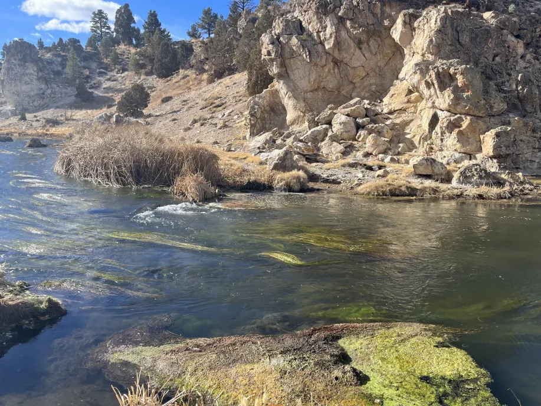

----
[<- Home](../../)
### TL;DR

**Flag**

```
amateursCTF{jk_i_lied_whats_a_bathroom_0f9e8d7c6b5a4321}
```

### Details

Description

> I was on an in-state skiing trip with my family when we decided to go out and see some sights. I remember needing to go to the bathroom near where these pictures were taken and then leaving a review. Can you find this review for me?


Files
- 2 images




From the first image, using goole lens, we can find that it's `HOT CREEK GEOLOGICAL SITE `


And conformation of that
GEO: `37.661039, -118.828682`


That said, we need to find some bathroom review near this place.

Near it, there are `Vault Toiltes`


And... there is a *fishy* review


Using [WhereItGoes](https://wheregoes.com/trace/20241848939/) checking were it goes lol. As it turns out, it redirects to pastebin 


 https://pastebin.com/jxaznYqH

The flag is located at the bottom end of the story about Flagotopia


```
amateursCTF{jk_i_lied_whats_a_bathroom_0f9e8d7c6b5a4321}
```