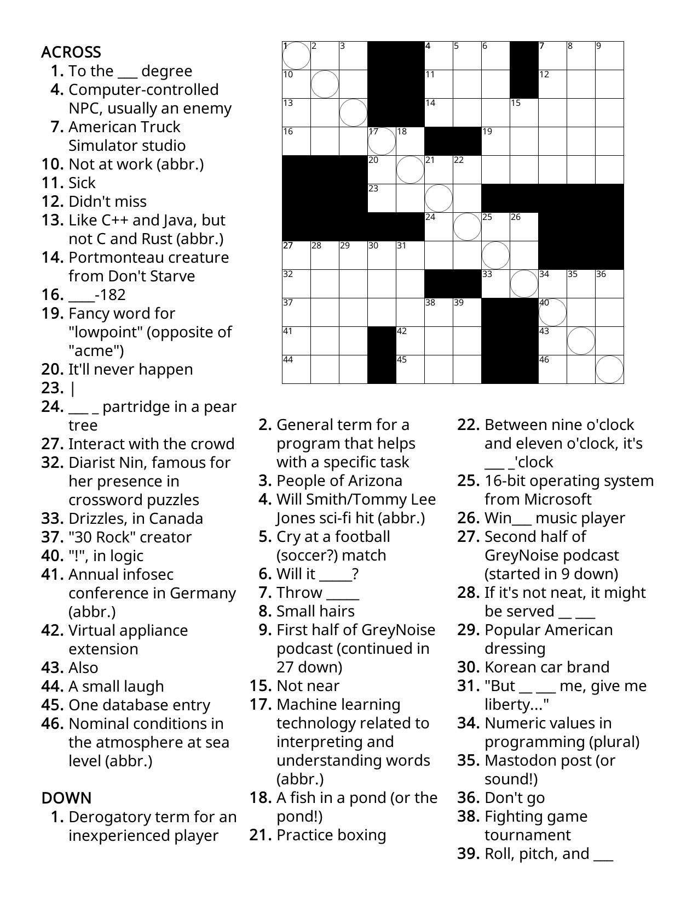

----
[<- Home](../../)
### TL;DR

**Flag**

```
CTF{nop-sled}
```

### Details

Description

> Solve the crossword in the program (or attached as a .html file) and answer this question:
> 
> What exploit technique can be found sliding down the puzzle in the circles? Flag is the answer in the form `CTF{___-____}` (all lowercase - a 3-letter word, hyphen, and a 4-letter word (requires some interpretation)).
> 


Files
- crossworthy.png
- crossworthy.html




```
CTF{nop-sled}
```