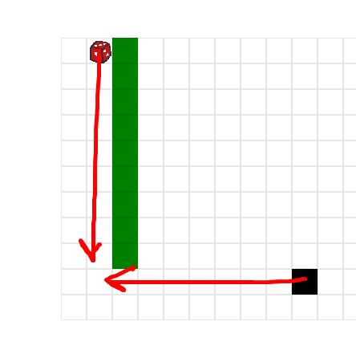
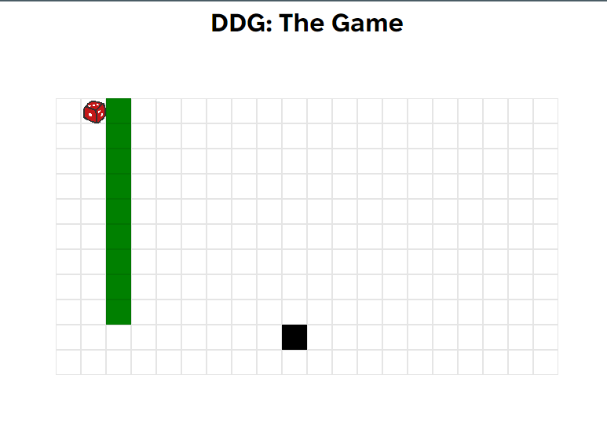
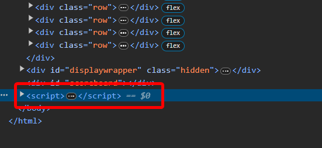
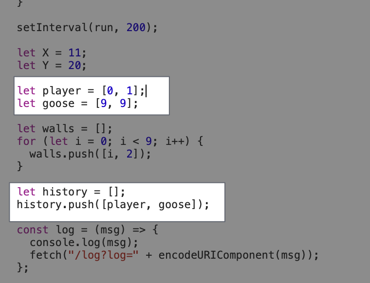
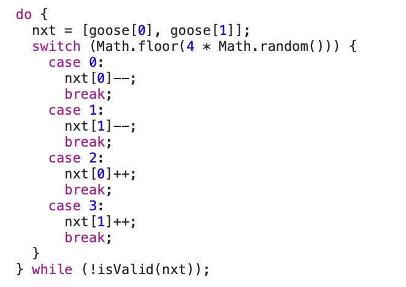
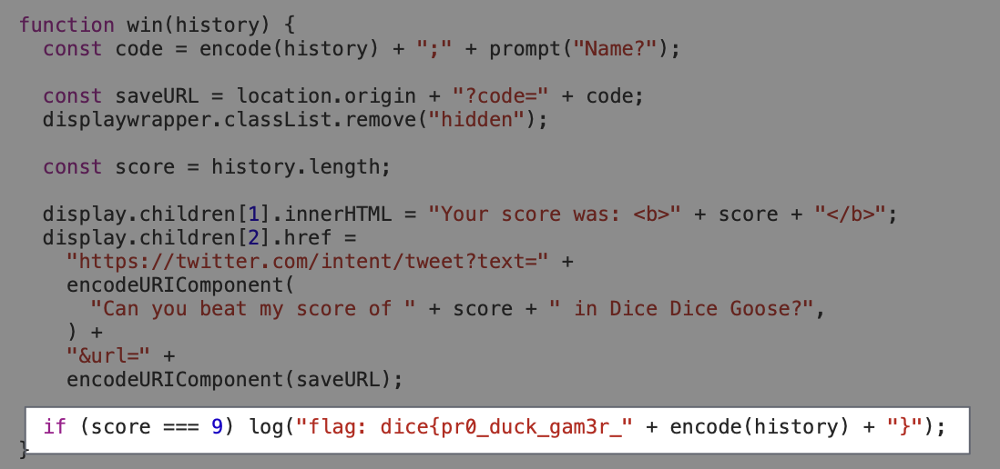
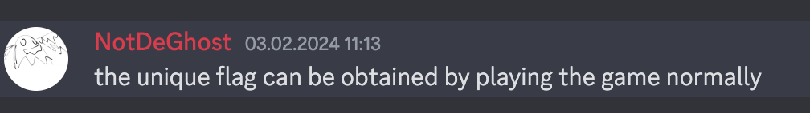
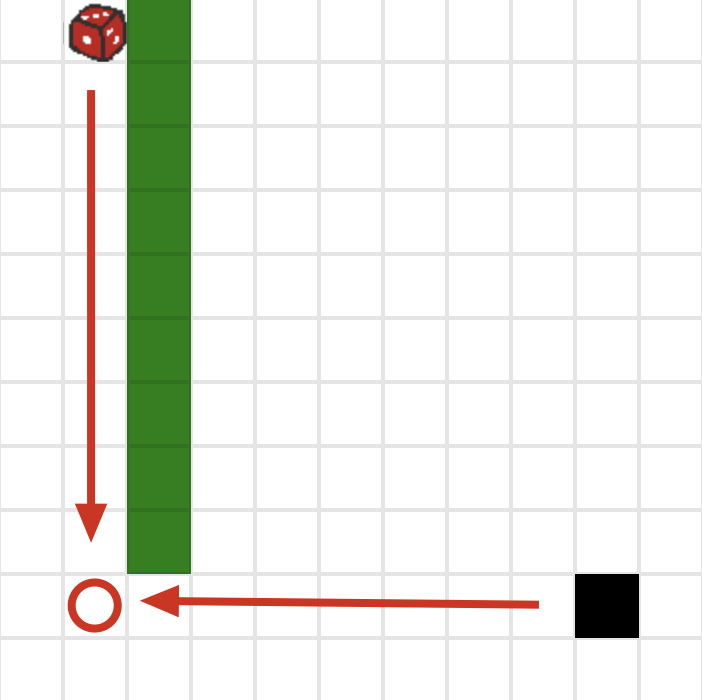
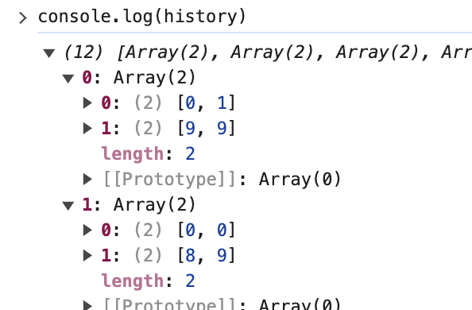
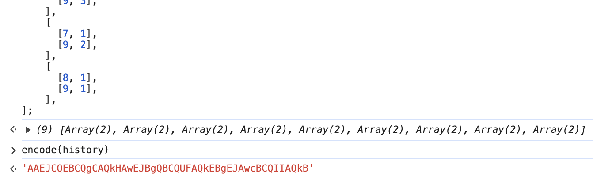

----

[<- Home](../../)
### TL;DR

To get a unique part of the flag, you need to get a specific history of moves



**Flag**

```
dice{pr0_duck_gam3r_AAEJCQEBCQgCAQkHAwEJBgQBCQUFAQkEBgEJAwcBCQIIAQkB}
```


### Details

We got this noice looking web DDG. 



Browsing trough dev utils, we can find `script` tag write inside html page. It is the main script, that controls all the actions.  



Here we can see, how history object is constructed



Also should to mention, that goose is walking randomly




At some point, we stumble upon `won` function that logs desired flag into console with 



The main condition is to get score equal to 9. From the same function, we can see that `score` is simply the length of the `history` array. 

```
flag: dice{pr0_duck_gam3r_<history>}
```

Also the flag contains encoded history object. It follows that we need to make the right move history. That is, to make a certain sequence of moves. 

From the hint, that was given in the discord server:



that points to the fact that we need to win the game with a *perfect* move history.


Where there is a circle, the `won` function will be triggered when the goose and the player collide



You can try to trace this history, but it will take a long time. 



Here is example of the history array after some random moves

Dice(player) starting at `[0,1]` and Goose at `[9,9]`

After some try and error, we can pin point, that Player's vertical changes from `[0...9,1]`
and Goose's horizontal -- `[9,9...0]` respectively.

And.... our constructed history should look like:

```js
history = [
	[
	  [0, 1],
	  [9, 9],
	],
	[
	  [1, 1],
	  [9, 8],
	],
	[
	  [2, 1],
	  [9, 7],
	],
	[
	  [3, 1],
	  [9, 6],
	],
	[
	  [4, 1],
	  [9, 5],
	],
	[
	  [5, 1],
	  [9, 4],
	],
	[
	  [6, 1],
	  [9, 3],
	],
	[
	  [7, 1],
	  [9, 2],
	],
	[
	  [8, 1],
	  [9, 1],
	],
];
```

As history was declared via `let` we could just overwrite it and pass to the encode function



As a result, we got the following string, which is the correct part of the flag

```
AAEJCQEBCQgCAQkHAwEJBgQBCQUFAQkEBgEJAwcBCQIIAQkB
```


---
### Appendix

solve.js
```js
function encode(history) {
    const data = new Uint8Array(history.length * 4);
    
    let idx = 0;
    for (const part of history) {
      data[idx++] = part[0][0];
      data[idx++] = part[0][1];
      data[idx++] = part[1][0];
      data[idx++] = part[1][1];
    }
    
    let prev = String.fromCharCode.apply(null, data);
    let ret = btoa(prev);
    return ret;
}
  
const history = [
	[
	  [0, 1],
	  [9, 9],
	],
	[
	  [1, 1],
	  [9, 8],
	],
	[
	  [2, 1],
	  [9, 7],
	],
	[
	  [3, 1],
	  [9, 6],
	],
	[
	  [4, 1],
	  [9, 5],
	],
	[
	  [5, 1],
	  [9, 4],
	],
	[
	  [6, 1],
	  [9, 3],
	],
	[
	  [7, 1],
	  [9, 2],
	],
	[
	  [8, 1],
	  [9, 1],
	],
];
  
const encodedResult = encode(history);
console.log("Encoded:", encodedResult);

// Result -> Encoded: AAEJCQEBCQgCAQkHAwEJBgQBCQUFAQkEBgEJAwcBCQIIAQkB
```
