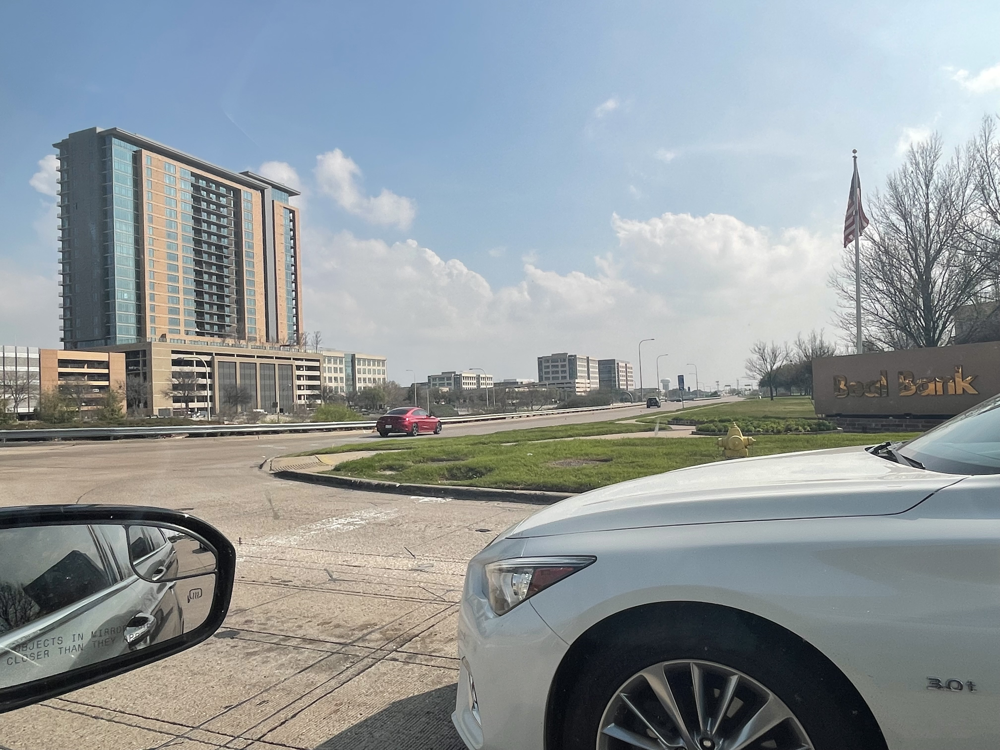
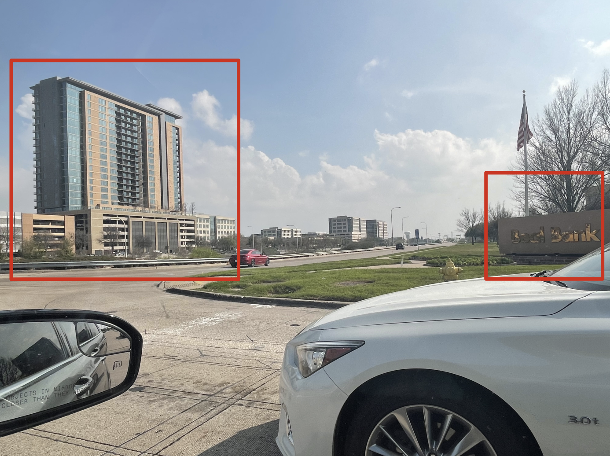
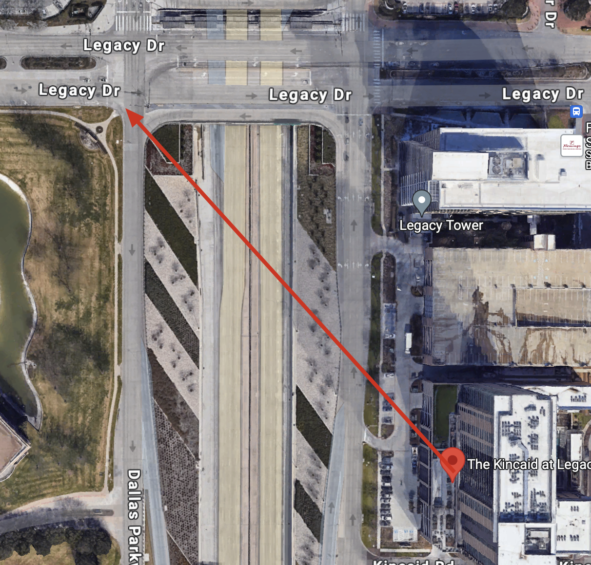

----
[<- Home](../../)
### TL;DR

Using google lens find the geolocation of the street

**Flag**

```
texsaw{LEGACY_DRIVE}
```

### Details

Description

> Find what street this picture was taken from.
> 
> Format the flag as the following: The street name in all caps with the spaces replaced by underscores. Write the full word for any abbreviated parts of the name.
> 
> Example: If the street was Bourbon St the flag would be: `texsaw{BOURBON_STREET}`

Files


Two points to search by


Using google lens, we can find that the building on the left is `The Kincaid at Legacy` located by these cords: `33.07626460190414, -96.82350007535273`. We know our point is across the street.



So, our destination is `Legacy Drive`