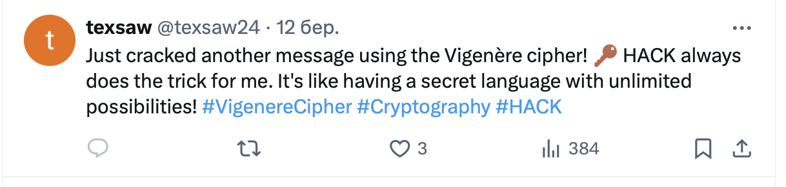
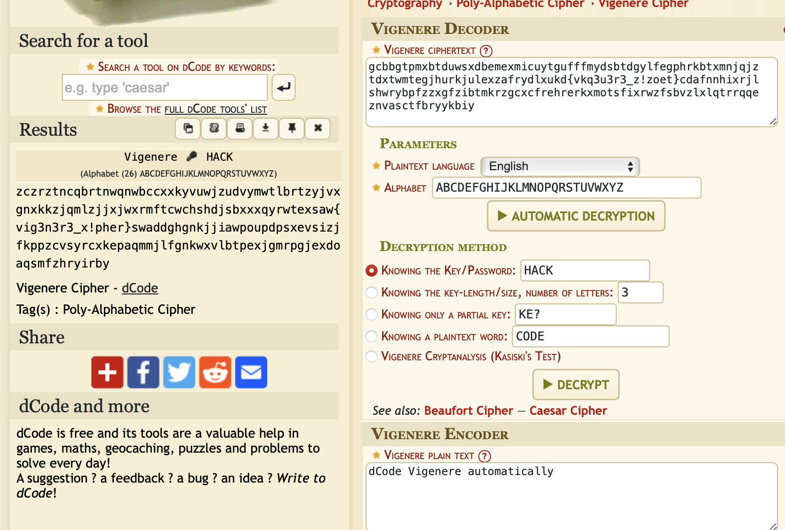

----
[<- Home](../../)
### TL;DR

**Flag**

```
texsaw{vig3n3r3_x!pher}
```

### Details

Recreated using this [WU](https://link.medium.com/yJZ46GuqkIb)

Description

> I need to study for a class but the quizlet I'm using has jumbled up answers that just don't make sense. Can you figure out how to read it?
> 
> [https://quizlet.com/882185739/sherlock-flash-cards/?funnelUUID=acf2df22-5f5c-4a67-9131-d0b6b18047df](https://quizlet.com/882185739/sherlock-flash-cards/?funnelUUID=acf2df22-5f5c-4a67-9131-d0b6b18047df)
>

Files
\<nope>

Browsing through cards, we can find two with {} brackets in them. Furthermore, we can see the flag structure
```
gcbbgtpmxbtduwsxdbemexmicuytgufffmydsbtdgylfegphrkbtxmnjqjztdxtwmtegjhurkjulexzafrydlxukd{vkq3u3r3
```

```
_z!zoet}cdafnnhixrjlshwrybpfzzxgfzibtmkrzgcxcfrehrerkxmotsfixrwzfsbvzlxlqtrrqqeznvasctfbryykbiy
```

```
texsaw{????????_?!????}
dlxukd{vkq3u3r3_z!zoet}
```


Also, from Quizlet we can find a Twitter/X profile that has only one post


So, possibly the key for Vigenere is - HACK

Combining two cards and throwing them to dcode.fr
```
gcbbgtpmxbtduwsxdbemexmicuytgufffmydsbtdgylfegphrkbtxmnjqjztdxtwmtegjhurkjulexzafrydlxukd{vkq3u3r3_z!zoet}cdafnnhixrjlshwrybpfzzxgfzibtmkrzgcxcfrehrerkxmotsfixrwzfsbvzlxlqtrrqqeznvasctfbryykbiy
```



We can see the flag in the results
```
zczrztncqbrtnwqnwbccxxkyvuwjzudvymwtlbrtzyjvxgnxkkzjqmlzjjxjwxrmftcwchshdjsbxxxqyrwtexsaw{vig3n3r3_x!pher}swaddghgnkjjiawpoupdpsxevsizjfkppzcvsyrcxkepaqmmjlfgnkwxvlbtpexjgmrpgjexdoaqsmfzhryirby
```

```
texsaw{vig3n3r3_x!pher}
```