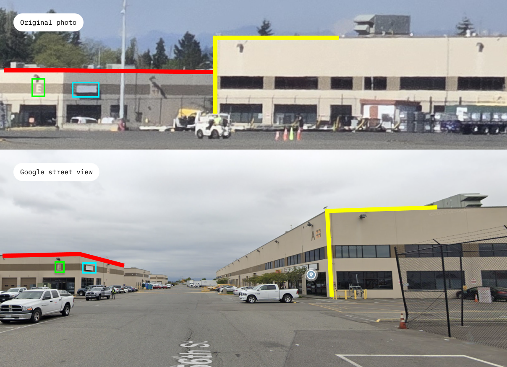

----
[<- Home](../../)
### TL;DR

**Flag**

```
uiuctf{Boeing C-17 Globemaster III, 47.462, -122.303}
```

### Details

**Description:**
Now that's a BIG plane! I wonder where it is. Flag format: uiuctf{plane type, coordinates of the aircraft} Example: uiuctf{Airbus A380-800, 40.036, -88.264}
For coordinates, just omit the digits, do not round up. Precision is the same as the one in the example. The aircraft name is the same as Wikipedia page title. You can extract enough information from this image to answer this. You DO NOT need to register any accounts, all the information is public.
Flag format clarification: The last digit of the first coordinate is even, and the last digit of the second coordinate is odd.


**Files:**


Now we know it's `Alaska Airlines`


Using jetphotos.com we can find that plane ID


So it's  `Boeing C-17A Globemaster III`, `P-182`, `07-7182`

Here are two ways to find the correct spot

**No. 1 - Transportation company**


By the building pattern via google lens find that it is https://www.transiplex.com

From their site, track to the Sea-Tac airport


Proof 



So the cameramen's view should probably be like this...


**No. 2 - C-17 flight history**

1. check photo exif info, and find out that it was created `2024:05:11 16:44:28.107`


2. using https://globe.adsbexchange.com/ check that date for `07-7182`


find out out C-17 was in Seattle on that day


So, it's `Boeing C-17 Globemaster III` and it is parked +- here `47.462, -122.303`


