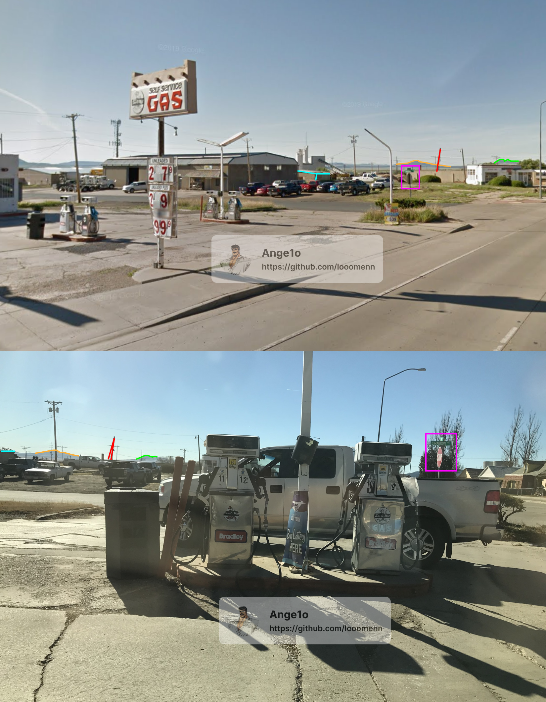

----
[<- Home](../../)
### TL;DR

**Flag**

```
Raton,NM,87740
```

### Details

Description

> Can you find where the person you identified in the first challenge lives? **Flag format is City,State,Zip.** For example, if they live at UT Austin submit Austin,TX,78712.
> Do not include any spaces in your submission. The submission is also case sensitive, and works with or without utflag{}.
> 
> By mzone (@mzone on discord)


Files
< nope :/ >


Same guy from osint1 chall

By his nickname from youtube we can find twitter 


Link - https://twitter.com/coleminerton

From it, you already can see lintree link  - https://linktr.ee/coleminerton


On his mastodon (
https://mastodon.social/@coleminerton) , we can find picture before trip 


Crealy can see gas station logo - `Sav-O-Mat GAS`


After some googling, we stumble upon this website - https://www.roadarch.com/gas/nm.html
were we can see some simillar location 


Googling `Sav-O-Mat station Raton, NM` we can find it's address 


Checking -- and it's cleary the same location 
 

Coordinates (WGS84) - `36.894849, -104.440730`

Based on the dialoge in the discord server and distance to 'Angel Fire' 


(76,5 miles, 1 hr 27 min)

We can state that `Cole Minerton` lives in Raton, NM

For ZipCode just googling `raton nm zip code` and get - `87740`

Combining all together we get - `Raton,NM,87740` and that is the flag!

```
Raton,NM,87740
```
