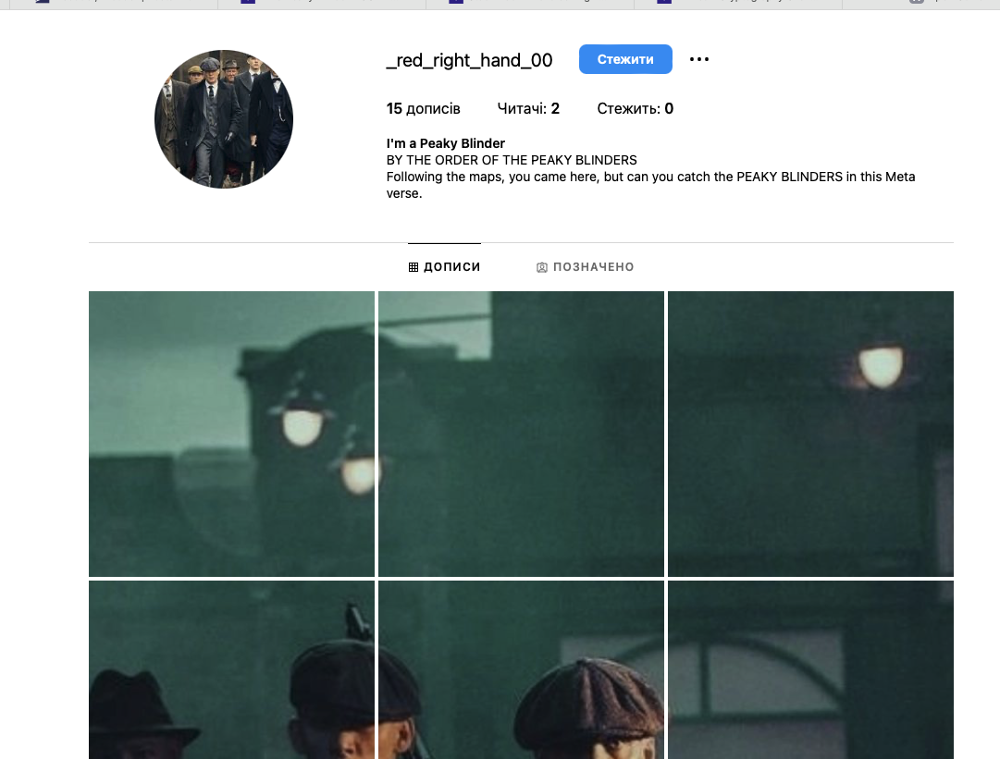
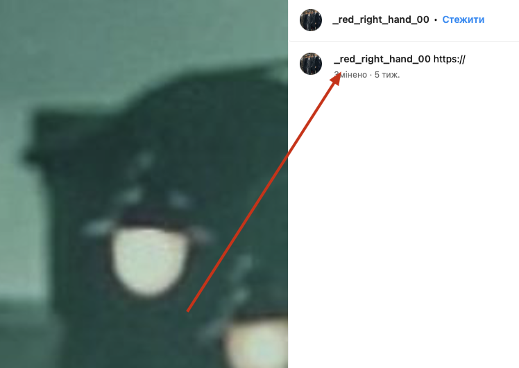
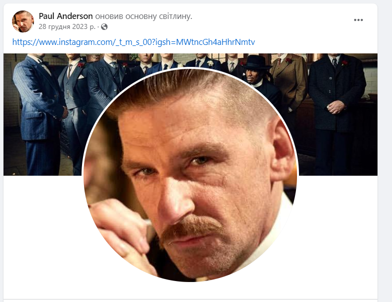
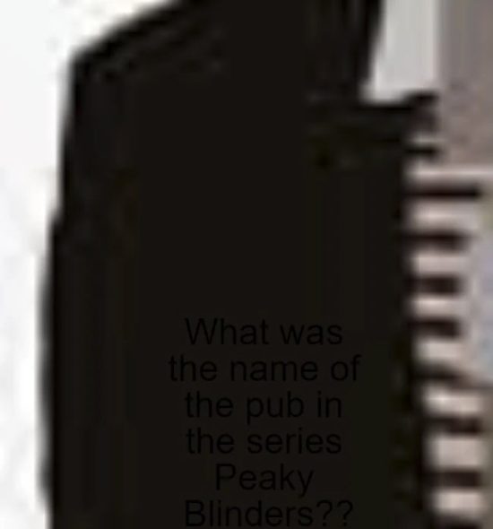

----

[<- Home](../../)
### TL;DR

A flag is an answer to a question found on an Instagram page: "What was the name of the pub in the series Peaky Blinders? "

**Flag**

```
VishwaCTF{The_Garison}
```

### Details

Description: 
```
Take a little walk to the edge of town  
Go across the tracks  
Where the viaduct looms,  
like a 00_bird_of_doom_  
As it shifts and cracks  
Where secrets lie in the border fires,  
in the humming wires  
Hey man, you know  
you're never coming back  
Past the square, past the bridge,  
past the mills, past the stacks  
On a gathering storm comes  
a tall handsome man  
In a dusty black coat with  
a _red_right_hand_00

Replace use _ instead of space

**Author : Abhinav (@.0_0.ace.0_0. )**
```

This line `_red_right_hand_00` is a instagram profile




On every post, in the description, is parts of the link




Full link
```
https://www.facebook.com/profile.php?id=61554610571803&mibextid=hIlR13
```


in feed there is another instagram account (RICK ROLL WARNING)



```
https://www.instagram.com/_t_m_s_00
```

and there is one picture that contains question



> What was the name of the pub in the series Peaky Blinders? 

-> The Garison


