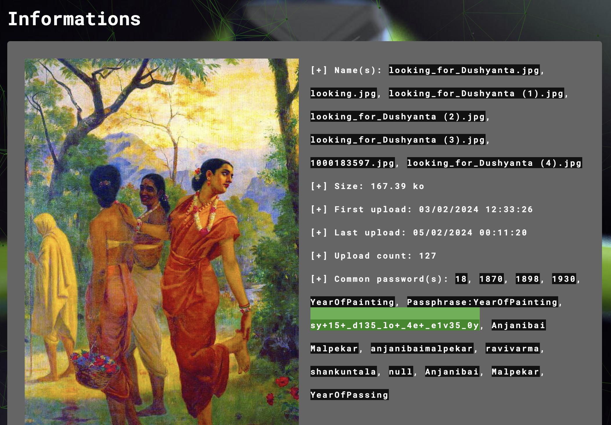
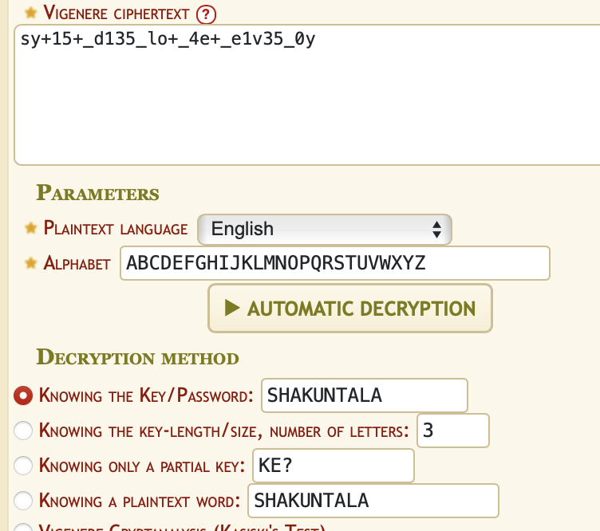

----
### TL;DR

**Flag**

```
VishwaCTF{ar+15+_d135_bu+_4r+_l1v35_0n}
```

### Details

Description
```
I was always fascinated by how a certain Indian artist combined Eurpoean realism with Indian sensibility. But this fascination wasn't enough help me remember the artist's name. Maybe you could give me a tip to score good in art histroy exams.
```

Got jpeg file, via AperiSolve got next string

```
sy+15+_d135_lo+_4e+_e1v35_0y
```




it is our flag encoded in some cypher. 

Another method to get it, was using stegseek to get pass and extract flag.txt
```
sy+15+_d135_lo+_4e+_e1v35_0y

The KEY to scoring good in art history is to always know the name of your muse.
```
(or just try one by one common passwords that was found earlier via aperi solve)

For the cypher, it is a Vigenere's one (more complex Ceaser) and our muse is shankuntala =>



from where we can get next string
```
ar+15+_d135_bu+_4r+_l1v35_0n
```

that was our flag


