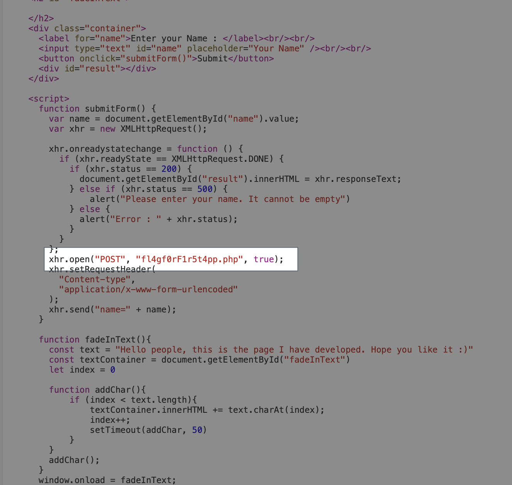
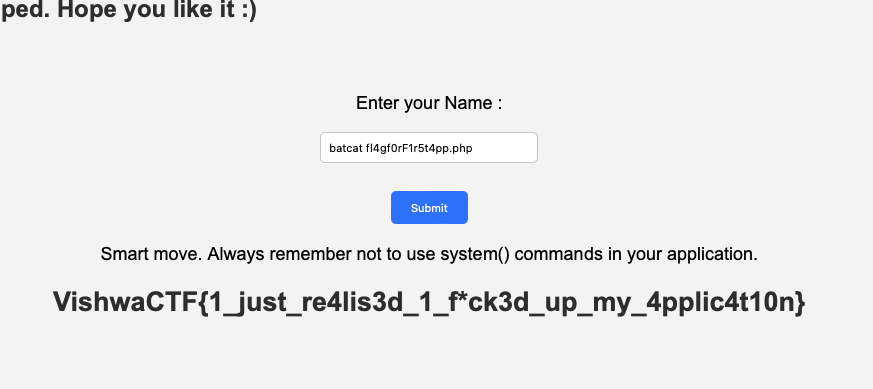

----
### TL;DR

**Flag**

```
VishwaCTF{1_just_re4lis3d_1_f*ck3d_up_my_4pplic4t10n}
```

### Details

Description:
```
After struggling for 2 days finally made my first web page. Still wondering why did I use Linux to host this.
```

Got web app with input. Digging down to files, we can see that it refers to specific `.php` file:
`fl4gf0rF1r5t4pp.php`



"Why did I use Linux to host this" - hint from the description

using batcat as input, cause cat isn't working:

```bash
batcat fl4gf0rF1r5t4pp.php
```




