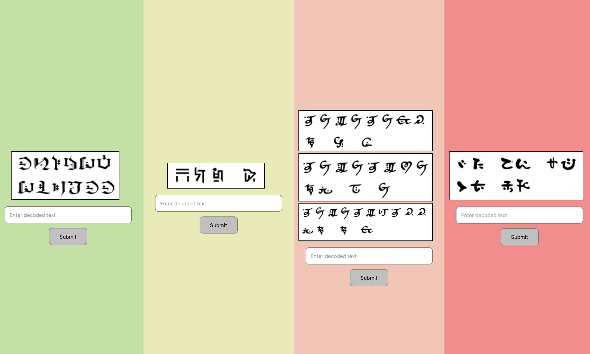
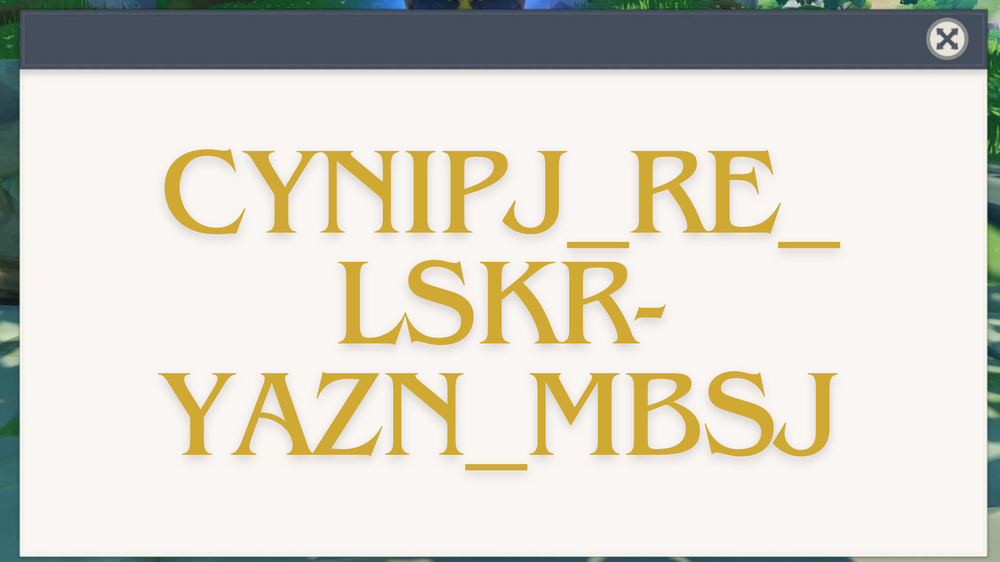
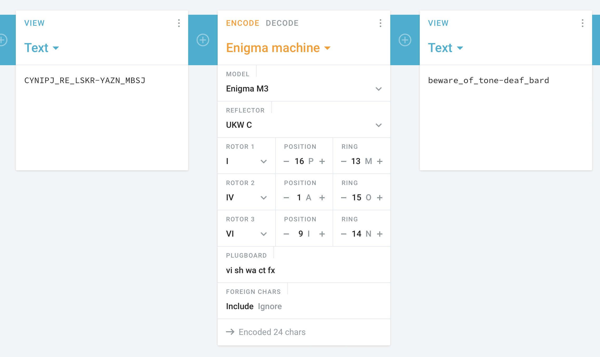

----
[<- Home](../../)
### TL;DR

**Flag**

```
VishwaCTF{beware_of_tone-deaf_bard}
```

### Details

Description
> All tavern owners in Mondstadt are really worried because of the frequent thefts in the Dawn Winery cellars. The Adventurers’ Guild has decided to secure the cellar door passwords using a special cipher device. But the cipher device itself requires various specifications….which the guild decided to find out by touring the entire Teyvat.
> 
> PS: The Guild started from the sands of Deshret then travelled through the forests of Sumeru and finally to the cherry blossoms of Inazuma
> 
> Author: Amruta Patil




Very interesting, but it could be skipped. Just take a look at `script.js`

```js
submitBtn1.addEventListener("click", ()=> {
    const inputText1 = document.getElementById("input1").value.trim();

    if (inputText1.toLowerCase() === "enigma m3") {
        firstFour.classList.remove("centered-align");
        firstFour.classList.add("hidden");
    }
    else{
        alert("Incorrect deciphering! Try again!")
    }
});

submitBtn2.addEventListener("click", ()=> {
    const inputText2 = document.getElementById("input2").value.trim();

    if (inputText2.toLowerCase() === "ukw c") {
        secFour.classList.remove("centered-align");
        secFour.classList.add("hidden");
    }
    else{
        alert("Incorrect deciphering! Try again!")
    }
});

submitBtn3.addEventListener("click", ()=> {
    const inputText3 = document.getElementById("input3").value.trim();

    if (inputText3.toLowerCase() === "rotor1 i p m rotor2 iv a o rotor3 vi i n") {
        thirdFour.classList.remove("centered-align");
        thirdFour.classList.add("hidden");
    }
    else{
        alert("Incorrect deciphering! Try again!")
    }
});

submitBtn4.addEventListener("click", ()=> {
    const inputText4 = document.getElementById("input4").value.trim();

    if (inputText4.toLowerCase() === "vi sh wa ct fx") {
        fourthFour.classList.remove("centered-align");
        fourthFour.classList.add("hidden");        
    }
    else{
        alert("Incorrect deciphering! Try again!")
    }
});
```

From it:

```
enigma m3
ukw c
rotor1 i p m rotor2 iv a o rotor3 vi i n
vi sh wa ct fx
```

So, it's settings for Enigma m3. And the ciphertext was in the image



```
CYNIPJ_RE_LSKR-YAZN_MBSJ
```

Applying these settings in cryptii 



we get the flag

```
VishwaCTF{beware_of_tone-deaf_bard}
```