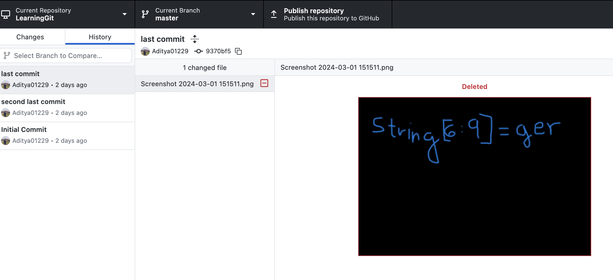

----
[<- Home](../../readme.md)
### TL;DR

You need to collect flag by char from past commits  

**Flag**

```
VishwaCTF{G1tG1gger_2727}
```


### Details

Description

> We got a suspicious Linkedin post which got a description and also a zip file with it. It is suspected that a message is hidden in there. Can you find it?
> 
> LinkedIn Post Description:
> 	Title: My First Project -The Journey Begins
> 	Hello fellow developers and curious minds!
> 	
> 	I'm thrilled to share with you my very first Git project - a labor of love, dedication, and countless late-night commits. 🚀
> 	
> 	Explore the code, unearth its nuances, and let me know your thoughts. Your feedback is invaluable and will contribute to the ongoing evolution of this project.
> 	
> Author : Aditya Jasoriya


Files


Apparently, you can use https://github.com/internetwache/GitTools/tree/master/Extractor to make it faster

Solved it using GitHub desktop (past commits are better visible there)

In branch No. 3 you can find the first part of the flag


```
string[0] = G
string[1] = 1 
string[2] = t
...
string[9] = _
string[10] = 2
string[11] = 7
string[12] = 2
string[13] = 7
```

Another past was in the deleted screenshot in master branch



Finally, the last part was in `index.html` ( Branch No. 2)


So, we ended up with 

```
string[0] = G
string[1] = 1 
string[2] = t
string[3: 6] = G1g
string[6:9] = ger
string[9] = _
string[10] = 2
string[11] = 7
string[12] = 2
string[13] = 7
```

Collect it together in one string and get the flag

```
VishwaCTF{G1tG1gger_2727}
```
