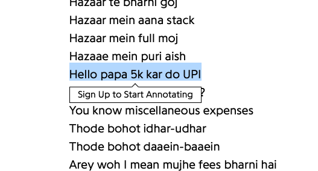

----
[<- Home](../../)
### TL;DR

**Flag**

```
VishwaCTF{Paradox_50000}
```

### Details

Description

> Me and my friends just finished our final semester of B.Tech, so we decided to have a trip somewhere, but due to some reason, many of them were not available for the trip, but we were all ok as less is more. As the trip was about to end, one of my friends said we should try scuba diving here. I was scared of that, but my friends said, If you don't risk anything, you risk everything. Seriously, why do we have to risk our lives for half an hour? It's impossible for me, I said. But they motivated me all night, and then it was time for the dive. I screamed, Impossible is not a word in my vocabulary, and dived in. After all this, when I came back to my room, I realised I was low on money, so I called and asked my father for some help by singing something like this: I’d be gone to my dad And ask for some cash I ran ......
> 
> All the Hustle towards the trip was worth it, as we enjoyed it a lot and made some awesome memories throughout the trip.
> 
> 
> Flag format: VishwaCTF{My Name according to story_Amount I got in figures}


Files
<\nope>


From this line in the description, we can figure out that it could be some song
```
I called and asked my father for some help by singing something like this: I’d be gone to my dad And ask for some cash I ran ......
```

Googling part about cash in Google, we get the next song

https://genius.com/Paradox-bt-ho-gayi-lyrics



From it, we get the amount of money = 5000 and the name is the author of this song itself.

So, the flag is 
```
VishwaCTF{Paradox_50000}
```