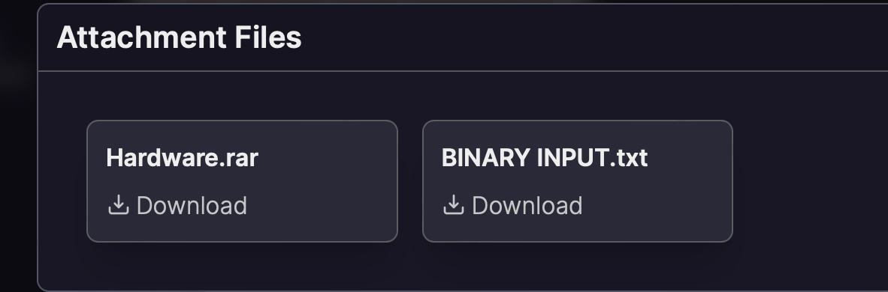
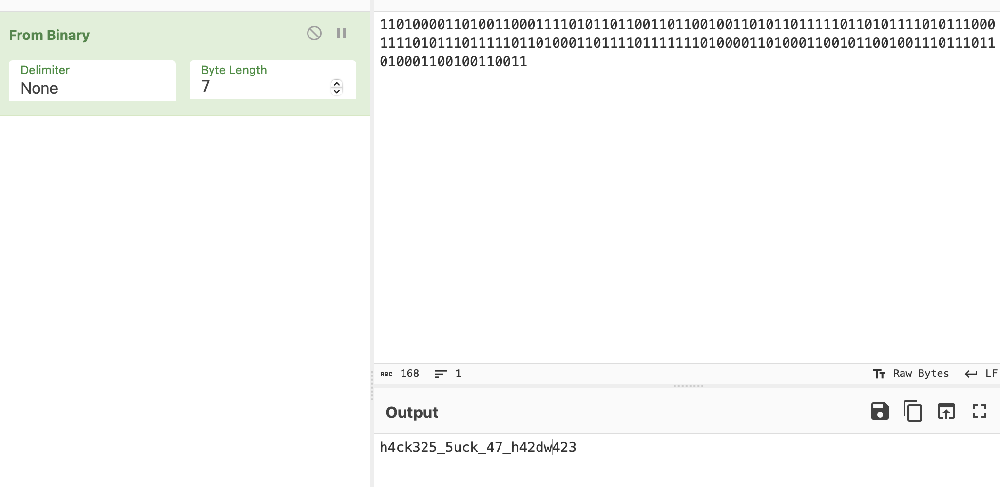

----
[<- Home](../../readme.md)
### TL;DR

Flag was hidden in the binary input(7 as byte length)

**Flag**

```
VishwaCTF{h4ck325_5uck_47_h42dw423}
```


### Details

Description

```
Your cyber gang has stolen a hardware device code from the CIA but are unable to use it. Although while stealing the code, you have found some binary strings which might be helpful to understand the device. You might even find the important codes after solving the device and strings.
```

Files



Hardware.rar, probably, is just junk code (rabbithole)

From .txt file we got binary string

```
110100001101001100011110101101100110110010011010110111110110101111010111000111101011101111101101000110111101111111010000110100011001011001001110111011010001100100110011
```

https://www.dcode.fr/ascii-code detected that it is binary with 7-byte length

