----
[<- Home](../../)
### TL;DR

Recreated using [WU1](https://github.com/CyberCell-Viit/VishwaCTF-24-Writeups/blob/main/VishwaCTF'24/Open%20Source%20Intelligence%20(OSINT)/Cyber%20Pursuit%20Manhunt.pdf) and [WU2](https://github.com/InfoSecIITR/write-ups/blob/master/2024/vishwa-ctf-2024/osint/Cyber%20Pursuit%20Manhunt.md)
 
**Flag**

```
VishwaCTF{simon_john_peter_tadobanationalpark.in}
```

### Details

Description

> In response to alarming reposts, our cybersecurity team is actively pursuing a hacker known by the alias h3ck3r_h3_bh41, who poses a serious threat by extorting innocent individuals for monetary gain. Your mission is to track down this hacker and provide us with the crucial information needed to apprehend them. 
> 
> Retrieve the Hacker's complete full name, formatted in lowercase and replacing spaces with underscores, along with the associated website domain. 
> 
> Flag format:
> VishwaCTF{full_name_domain.in}

Files
<\nope>

Using the given alias `h3ck3r_h3_bh41` we can find the twitter profile - https://twitter.com/h3ck3r_h3_bh4

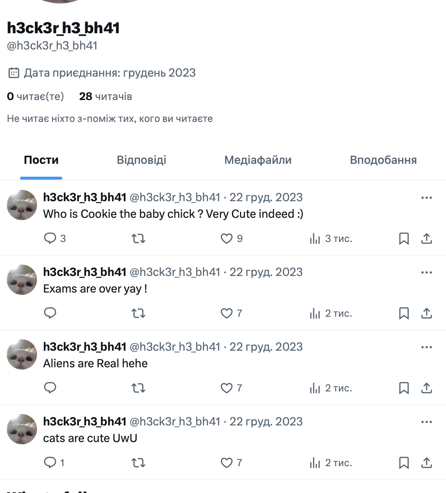

There is one particular post that can catch your attention
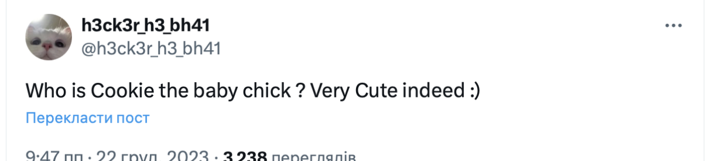
Link - https://x.com/h3ck3r_h3_bh41/status/1738285225631756610

Copying `Cookie the baby chick` and pasting it into Instagram we can find other profile

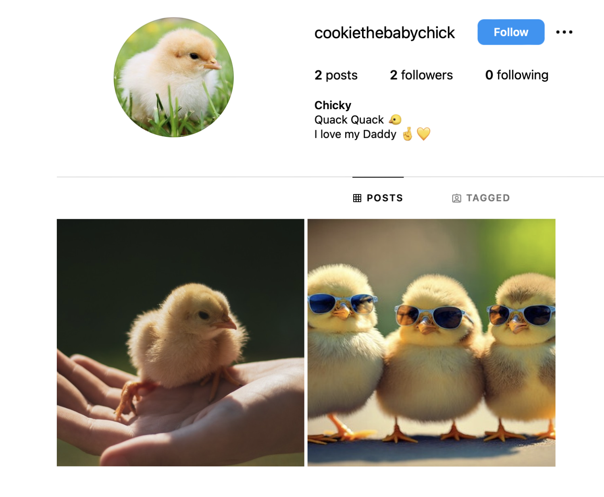
Link - https://www.instagram.com/cookiethebabychick/


There are two posts, from the first one we can get the link to "Dad's" YouTube channel
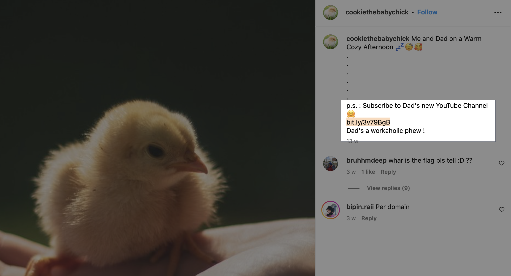
Link - https://www.instagram.com/p/C1KsdoRBzhk/

Adding + at the end of the bit.ly link, we can see where it goes
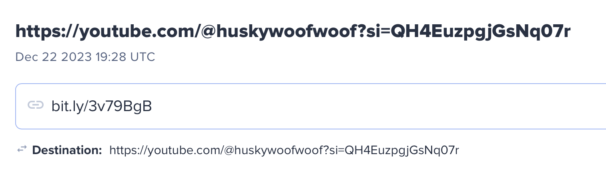
https://bit.ly/3v79BgB+ -> https://youtube.com/@huskywoofwoof?si=QH4EuzpgjGsNq07r
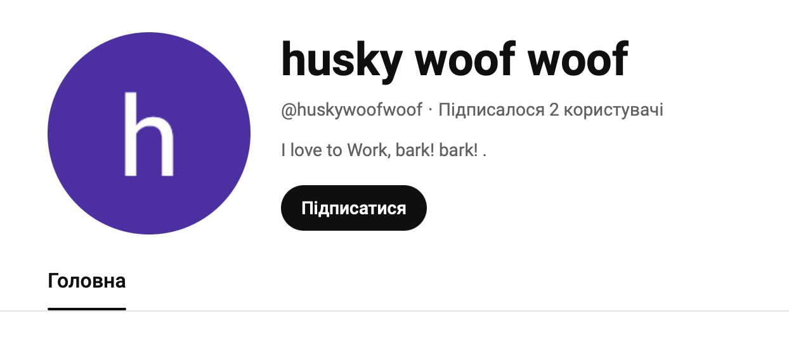


Another interesting thing is, in the followers, there is one particular person

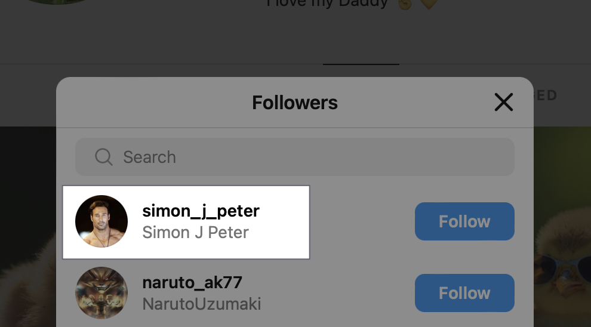

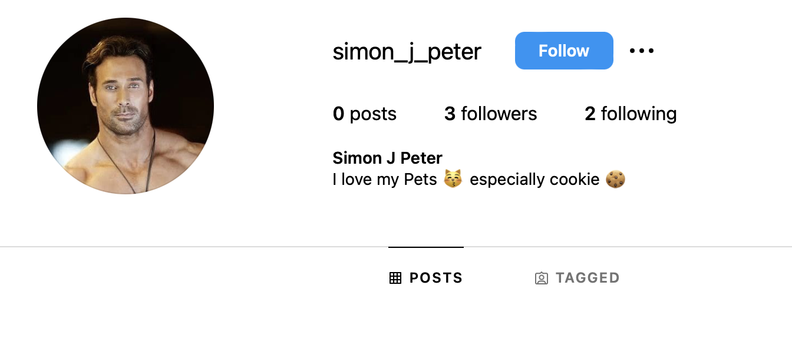
Link - https://www.instagram.com/simon_j_peter/

He loves Pets (with an accent on this word). Probably, it is the 'father' of the user `cookiethebabychick`. As required in the task, we need Hacker's first and last name. 

Nevertheless, continuing searching by name of the YouTube channel, we can find a profile on the Linkedin

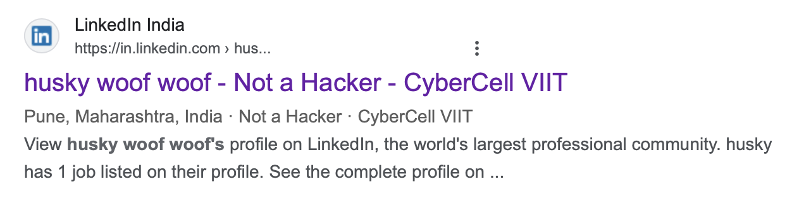
Link - https://in.linkedin.com/in/husky-woof-woof-3800342b8 

At the time of writing this WU, the profile has already been deleted :/


Basically, from it we should find his middle name (John) and a link: 
https://postlmg.cc/HVPR8h0Y
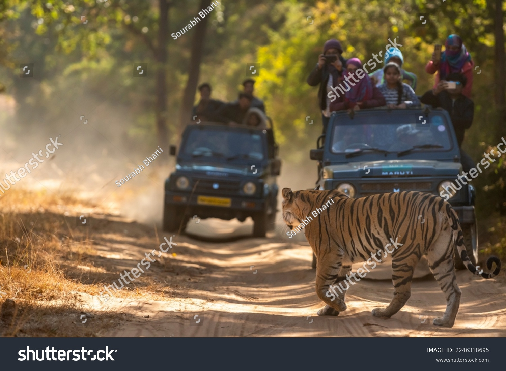


Checking its metadata, we can find its geolocation
https://www.aperisolve.com/71e1ce1ba9be9cfa5e93d30cc8b52870
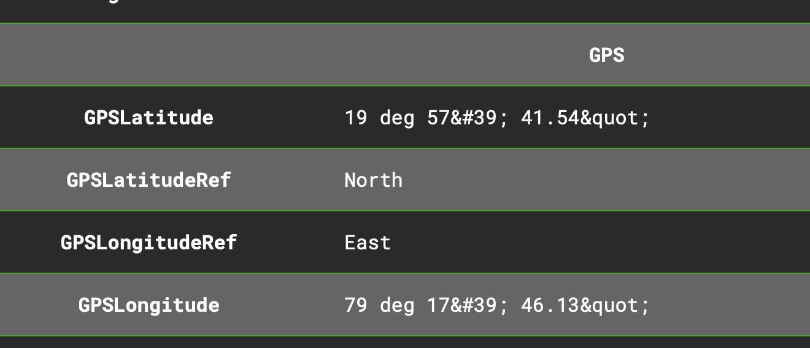

So, it's: `19°57'41.5"N, 79°17'46.1"E` that converts into `19.961539, 79.296148` in WGS84 --> City: Chandraur

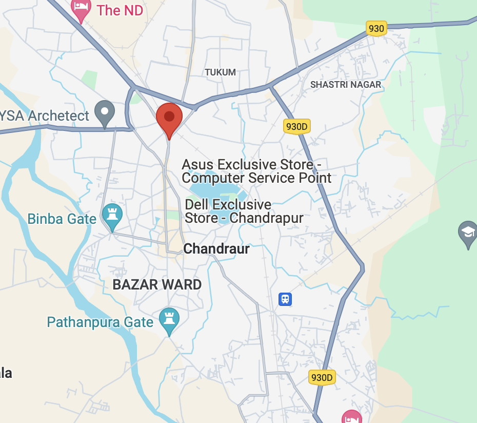

Referring back to the image with the tiger. Possibly, we need to find some place where tigers can be in this city. 

Searching `tiger` within a city location, we get one place

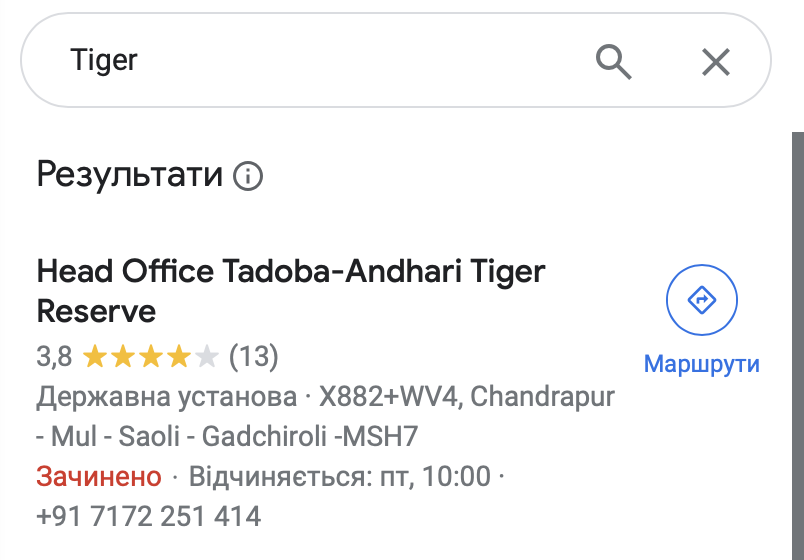

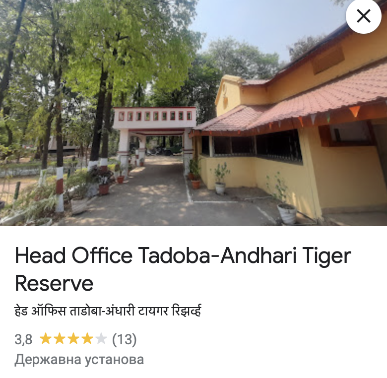

Head Office Tadoba-Andhari Tiger Reserve

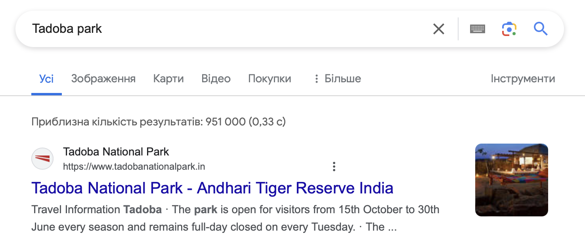

More searching and we get it's website - `https://www.tadobanationalpark.in`

Combining all together, we get a flag: 

```
VishwaCTF{simon_john_peter_tadobanationalpark.in}
```