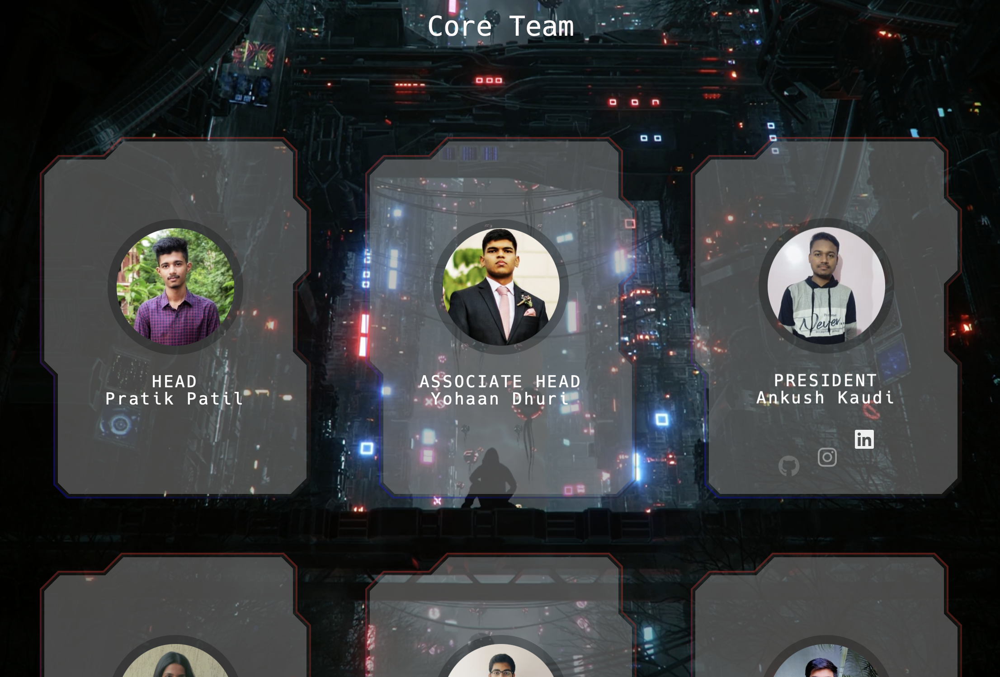
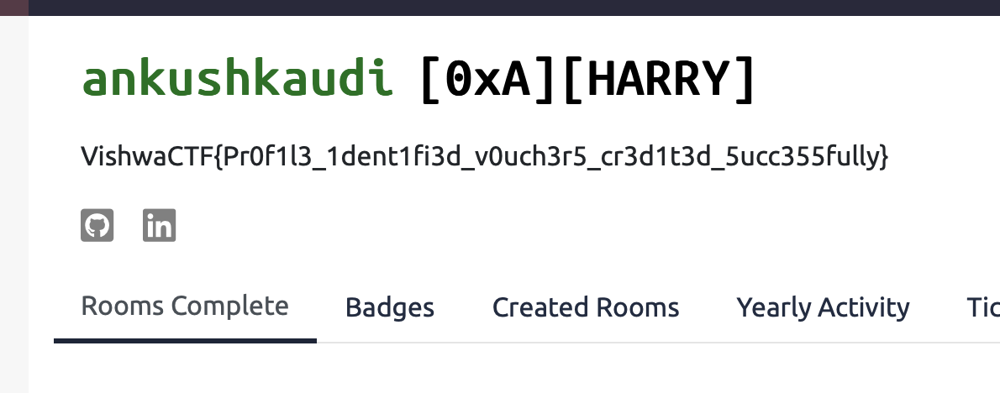

----
### TL;DR

In the description of this profile
https://tryhackme.com/p/ankushkaudi

**Flag**

```
VishwaCTF{Pr0f1l3_1dent1fi3d_v0uch3r5_cr3d1t3d_5ucc355fully}
```

----
### Details

Description

> TryHackMe is a browser-based cyber security training platform, with learning content covering all skill levels from the complete beginner to the seasoned hacker.
> 
> One of our team members is very active on the platform. Recently, I got to know that he comes under 3% in the global leaderboard. Impressive isn't it.
> 
> Maybe you should have a look at his profile
> 
> PS : He keeps his digital identity very simple. No fancy usernames. It's just a simple mathematics
> 
> His real name == His username
> 
> **Author : Amruta Patil**

As it was mentioned before, he is one of the VishwaCTF team members.

From this page
https://vishwactf.com/team/team.html



So, we just need to check every member of the team for THM profile by substituting their names in THM profile page link

```
https://tryhackme.com/p/<name without spaces>
```

It's not efficient and glad that the person we needed was there at the very beginning. Apparently, it could be automated: scrape their names via some web scrapper, and via python request make script that will go through possible name case combinations (AA, Aa, aA, aa) 

