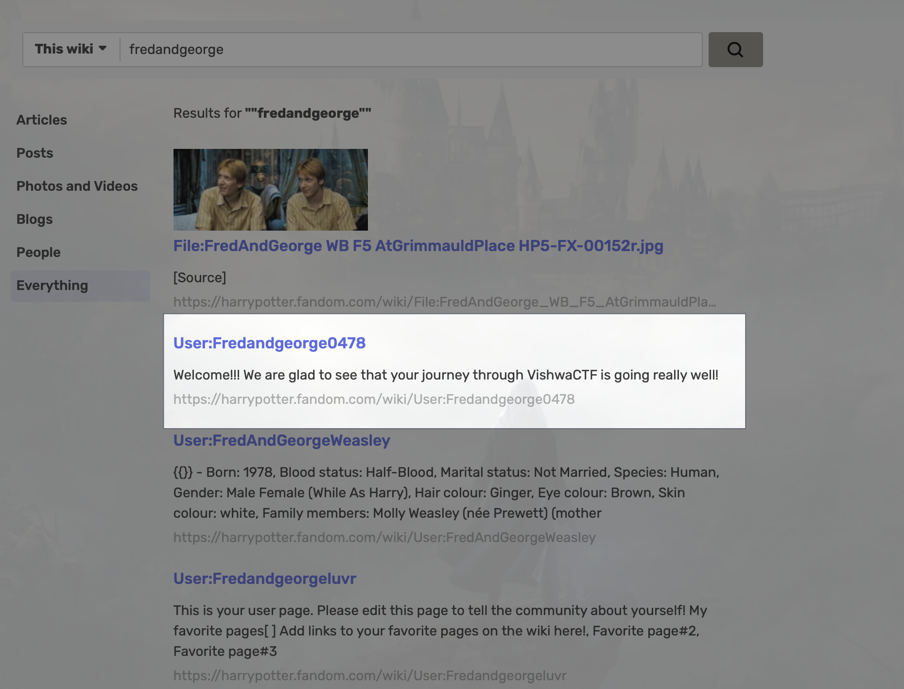
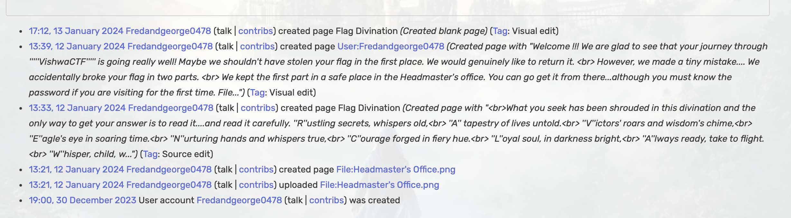
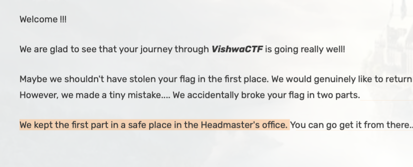
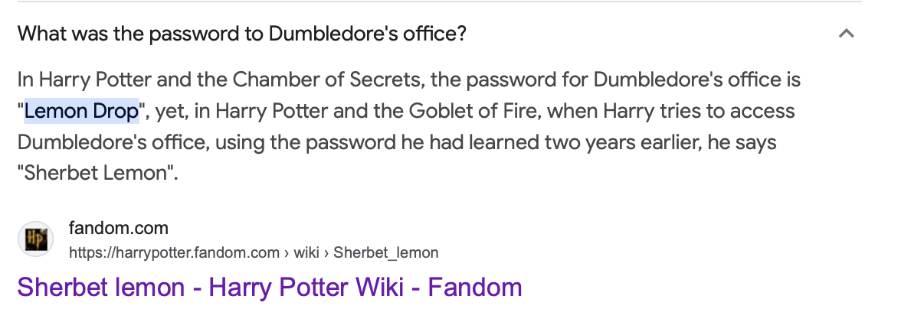

----
[<- Home](../../)
### TL;DR

Recreated using this [WU](https://github.com/CyberCell-Viit/VishwaCTF-24-Writeups/blob/main/VishwaCTF'24/Open%20Source%20Intelligence%20(OSINT)/Prankster%20Twins.pdf)

**Flag**

```
VishwaCTF{LemonDrops_RAVENCLAW}
```

### Details

Description

> I was on my way to deliver the flag straight to you, but it was stolen enroute by the Prankster Twins. They looked as if they walked out of a famous fantasy. All you have to do to get back the flag is roleplay as the protagonist of the fantasy who once received something from the Twins.
> 
> Carefully listen to what the previous owners of the magical item had to say about it. P.S.- I feel that the thing they gave, although a secret, has a huge fan base. 
> 
> Flag format:
> VishwaCTF{FirstTimePassword(CamelCase)\_AnswerFromDivination(InAllCaps)}
> 

Files
AboutMagicalItem.mp3


This audio is part of the dialogue between Harry Potter and the Weasley brothers when they give him the Marauder's Map.

[Searching](https://harrypotter.fandom.com/wiki/Special:Search?scope=internal&query=fredandgeorge&ns%5B0%5D=0&ns%5B1%5D=1&ns%5B2%5D=2&ns%5B3%5D=3&ns%5B4%5D=4&ns%5B5%5D=5&ns%5B6%5D=6&ns%5B7%5D=7&ns%5B8%5D=8&ns%5B9%5D=9&ns%5B10%5D=10&ns%5B11%5D=11&ns%5B12%5D=12&ns%5B13%5D=13&ns%5B14%5D=14&ns%5B15%5D=15&ns%5B16%5D=110&ns%5B17%5D=111&ns%5B18%5D=112&ns%5B19%5D=113&ns%5B20%5D=420&ns%5B21%5D=421&ns%5B22%5D=500&ns%5B23%5D=501&ns%5B24%5D=502&ns%5B25%5D=503&ns%5B26%5D=828&ns%5B27%5D=829&ns%5B28%5D=1200&ns%5B29%5D=1201&ns%5B30%5D=1202&ns%5B31%5D=2000&ns%5B32%5D=2001&ns%5B33%5D=2002&ns%5B34%5D=2900&ns%5B35%5D=2901) `fredandgeorge` in the harry potter wiki, we can find an account associated with the CTF


Using[ wiki logs](https://harrypotter.fandom.com/wiki/Special:Log/Fredandgeorge0478), we can find edits by this account



From it, we can see the content of the page called `Flag Divination`
```
[...] created page Flag Divination (Created page with "<br>What you seek has been shrouded in this divination and the only way to get your answer is to read it....and read it carefully. ''R''ustling secrets, whispers old,<br> ''A'' tapestry of lives untold.<br> ''V''ictors' roars and wisdom's chime,<br> ''E''agle's eye in soaring time.<br> ''N''urturing hands and whispers true,<br> ''C''ourage forged in fiery hue.<br> ''L''oyal soul, in darkness bright,<br> ''A''lways ready, take to flight.<br> ''W''hisper, child, w...")  [Tag](https://harrypotter.fandom.com/wiki/Special:Tags "Special:Tags"): Source edit
```

We can see some letters are in uppercase, let's collect them into one word:
```
RAVENCLAW
```

So, it's the second part of the flag -- Answer from Divination. 

For the first part of the flag, we can find hint in the brothers' profile itself:


Googling `first time password for the headmaster's office dumbledore`


gets us the first part of the flag - `LemonDrop` 

So, the flag is:
```
VishwaCTF{LemonDrops_RAVENCLAW}
```
