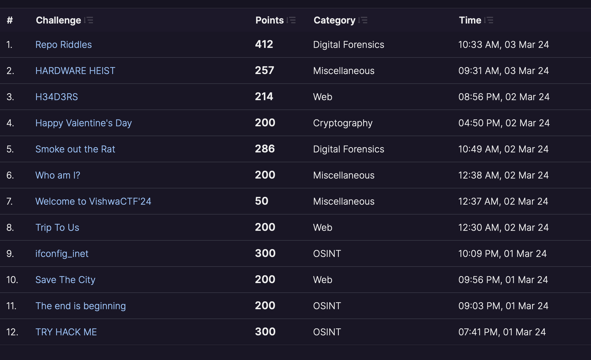

# VishwaCTF

[<- Main page](../../)

Our writeups from VishwaCTF 2024
## Stats

**Team**: dead_davinci  
**CTF**: VishwaCTF 2024  
**Dates**: 01.03.2024 - 03.03.2024  
**Solved**: 12  
**Points**: 2819  
**Place**: 129  
**First / Second / Third Bloods**: 1 / 0 / 0  

## Tasks

Here you can find every task structured by category with a link to it.

**Web**
- [Headers](web/headers/readme.md) (Stolen chall from WxMCTF 2023 - [WU](https://github.com/daffainfo/ctf-writeup/tree/main/2023/WxMCTF%202023/WxMCTF%20Web%202%20-%20Restricted%20Access))
- [Recipe Archival Workshop](web/raw/readme.md)
- [Save The City](web/save-the-city/readme.md)
- [Trip To Us](web/trip-to-us/readme.md)
- [Prompt Injection](https://ctftime.org/writeup/35786) (Stolen chall from Sekai CTF 2022)
- [They are coming](web/they-are-coming/readme.md)

**Osint**
- [Ifconfig inet](osint/ifconfig-inet/readme.md)
- [Try Hack Me](osint/try-hack-me/readme.md)
- The end is beginning (WIP)

**Steg**
- [Old Case](steg/old-case/readme.md)
- [Secret Code](steg/secret-code/readme.md)
- [We are valorant](steg/we-are-valorant/readme.md)

**Misc**
- [Hardware Heist](misc/heist/readme.md)
- Who am I (WIP)

**Digital Forensics**
- [Repo Riddles](difor/repo-riddles/readme.md)
- Smoke out the Rat (WIP)

**Crypto**
- [Teyvat Tales](crypto/teyvat-tales/readme.md)
- [Valentine's Day](crypto/valentines-day/readme.md)

