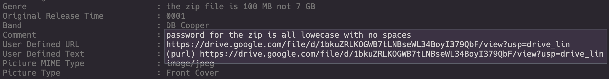

----
### TL;DR

**Flag**

```
VishwaCTF{1_W!LL_3E_B@CK}
```

### Details

Description

> You as a FBI Agent, are working on a old case involving a ransom of $200,000. After some digging you recovered an audio recording. 
> 
> Author : Abhishek Mallav

Files: `final.mp3`

From the start using exiftool on `final.mp3`, we can get a link to Google Drive with flight logs and a hint for the password (in the comment)



https://drive.google.com/file/d/1bkuZRLKOGWB7tLNBseWL34BoyI379QbF

From the file itself, there is one part with reversed voice. After reversing whole track and and transcribing it we ended up next text: 

```
I am Dan Cooper. It is 24th of November 1971. Now I have left from Seattle and headed towards Reno. I have got all my demands fulfilled. I have done some changes in the flight log and uploaded it to a remote server. The file is encrypted. The hint for description is the airliner that I was flying in. Most importantly, the secret key is split and hidden in every element of the Fibonacci series starting from...
```

From Wikipedia, we can find that he was flying in [Northwest Orient Airlines](https://en.wikipedia.org/wiki/Northwest_Airlines "Northwest Airlines") Flight 305, a [Boeing 727](https://en.wikipedia.org/wiki/Boeing_727 "Boeing 727") aircraft, in United States airspace on November 24, 1971.

So, the password for the zip will be `northwestorientairlines`. 

From the same wiki page (as mentioned before) we can get the flight number for our log file. Another way is to grep by date:

```bash
grep -Ril 1971 *.log
```

![[assets/img-2.png]]

So, our file is `Flight-305.log`

![[assets/img-3.png]]

We already can see `Vishwa` in lines. Furthermore, ATT and HWR logs are all the same, so we can use the replace tool in vscode to clear the file

![[assets/img-4.png]]

![[assets/img-5.png]]

And for the whitespaces:

![[assets/img-6.png]]

![[assets/img-7.png]]

