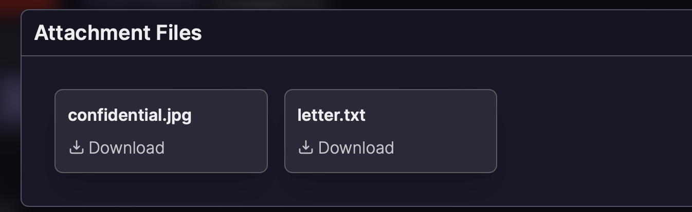
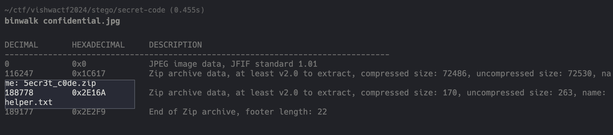
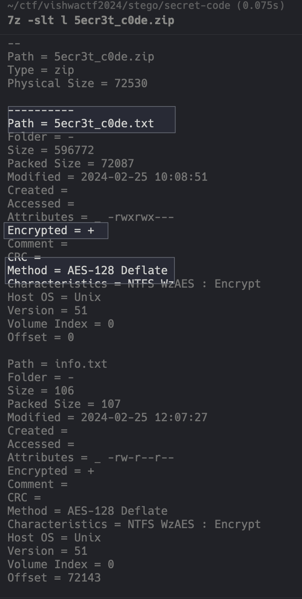
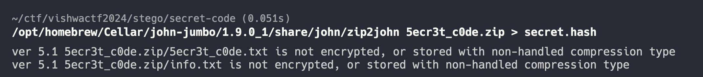
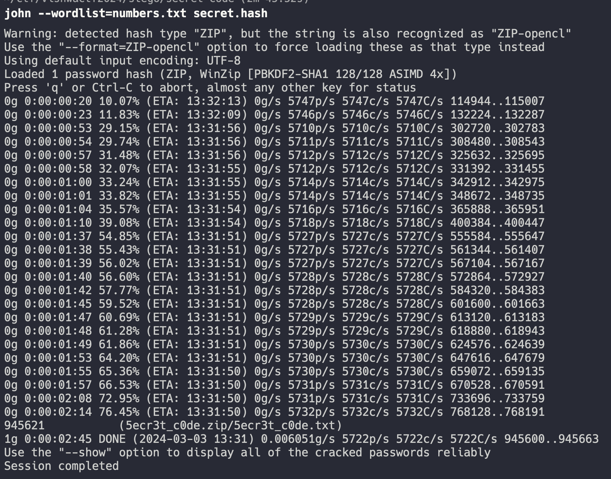

----
### TL;DR

Recreated according to this [writeup](https://github.com/warlocksmurf/onlinectf-writeups/blob/main/VishwaCTF24/steganography.md#task-3-secret-code) by [warlocksmurf](https://github.com/warlocksmurf)
 
**Flag**

```
VishwaCTF{th15_15_4_5up3r_53cr3t_c0d3_u53_1t_w153ly_4nd_d0nt_5h4re_1t_w1th_4ny0ne}
```


### Details

Description
```
Akshay has a letter for you and need your help

Author : Ankush Kaudi
```

Files:



Using binwalk to find hidden archive and txt file in `.jpg` 


```
binwalk -e confidential.jpg
```

uzing 7z, we can see that all files are encrypted



From text.txt 
```
Hey buddy, I'm really sorry if this takes long for you to get the password. But it's a matter of $10,000,000 so I can't risk it out.

"I really can't remember the password for zip. All I can remember is it was a 6 digit number. Hope you can figure it out easily"
```

So, we now the password is 6 digit long. Here to paths to take.

Using zip2john and john to crack hash or via python script.

Python script: 
```python
def slow_sole():
    zip_path = '5ecr3t_c0de.zip'

    def try_password(zip_file, password):
        try:
            with pyzipper.AESZipFile(zip_file) as zf:
                zf.extractall(pwd=bytes(password, 'utf-8'))
                return True
        except:
            print(f'{password}', end='\r')
            return False

    for i in range(1000000):
        password = str(i).zfill(6)
        if try_password(zip_path, password):
            print(f'Success! The password is: {password}')
            break
```
This way is reeeeealy slow, but it works!


And, faster way: john the ripper
```bash
zip2john 5ecr3t_c0de.zip > secret.hash
```



```bash
john --wordlist=numbers.txt secret.hash
```



So, password is `945621`

From this zip we got two files: info.txt
```
What are these random numbers? Is it related to the given image? Maybe you should find it out by yourself
```

and `5ecr3t_c0de.txt`
```
(443, 1096)
(444, 1096)
(445, 1096)
(3220, 1096)
(3221, 1096)

...

(443, 1166)
(444, 1166)
(3221, 1166)
(3222, 1166)

-- 47102 total lines --
```

It looks like coordinates in x, y format. Here we have to remember that we had an empty image `confidential.jpg` from the beginning, so we may need to change the color of the pixels placed at these coordinates from black to white.

Specific part of the `solve.py` for that
```python
def read_coords(file_path: str):
    with open(file_path, 'r') as fl:
        lines: list = fl.readlines()
    
    coords: list = []
     
    for line in lines:
        x, y = line.replace('(', '').replace(')', '').split(',') 
        coords.append((int(x), int(y)))

    return coords

def drawer(image_path: str, coords: list, out_path: str):
    img = Image.open(image_path)
    for coord in coords: 
        img.putpixel(coord, (255,255,255))
    img.save(out_path)
```

Running that script, we ended up with flag in image


---
### Appendix

solve.py
```python
import pyzipper
from PIL import Image
import pytesseract


def slow_sole():
    zip_path = '5ecr3t_c0de.zip'

    def try_password(zip_file, password):
        try:
            with pyzipper.AESZipFile(zip_file) as zf:
                zf.extractall(pwd=bytes(password, 'utf-8'))
                return True
        except:
            print(f'{password}', end='\r')
            return False

    for i in range(1000000):
        password = str(i).zfill(6)
        if try_password(zip_path, password):
            print(f'Success! The password is: {password}')
            break
    
    
def generate_numbers():
    with open('numbers.txt', 'w') as file:
        for i in range(1000000):
            file.write(f"{i}\n")
    

def read_coords(file_path: str):
    with open(file_path, 'r') as fl:
        lines: list = fl.readlines()
    
    coords: list = []
     
    for line in lines:
        x, y = line.replace('(', '').replace(')', '').split(',') 
        coords.append((int(x), int(y)))

    return coords

def drawer(image_path: str, coords: list, out_path: str):
    img = Image.open(image_path)
    for coord in coords: 
        img.putpixel(coord, (255,255,255))
    img.save(out_path)


def extract_flag(image_path: str):
    img = Image.open(image_path)
    text = pytesseract.image_to_string(img)
    
    return text


def main():
    # drawer('confidential.jpg', read_coords('5ecr3t_c0de.txt'), 'flag.jpg')
    print(extract_flag('flag.jpg'))
    

if __name__ == "__main__":
    main()

```

*Was too lazy to copy the flag from the image manually... Wrote a script using pytesseract to automate this process. But...... it extracted the flag with errors, so I had to do it manually lol*

