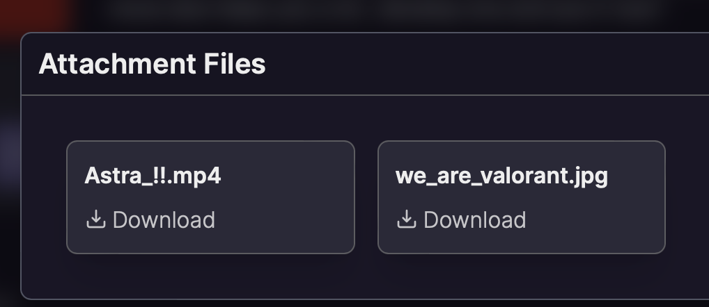
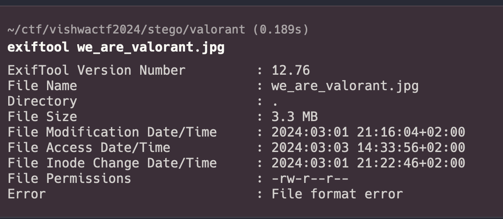
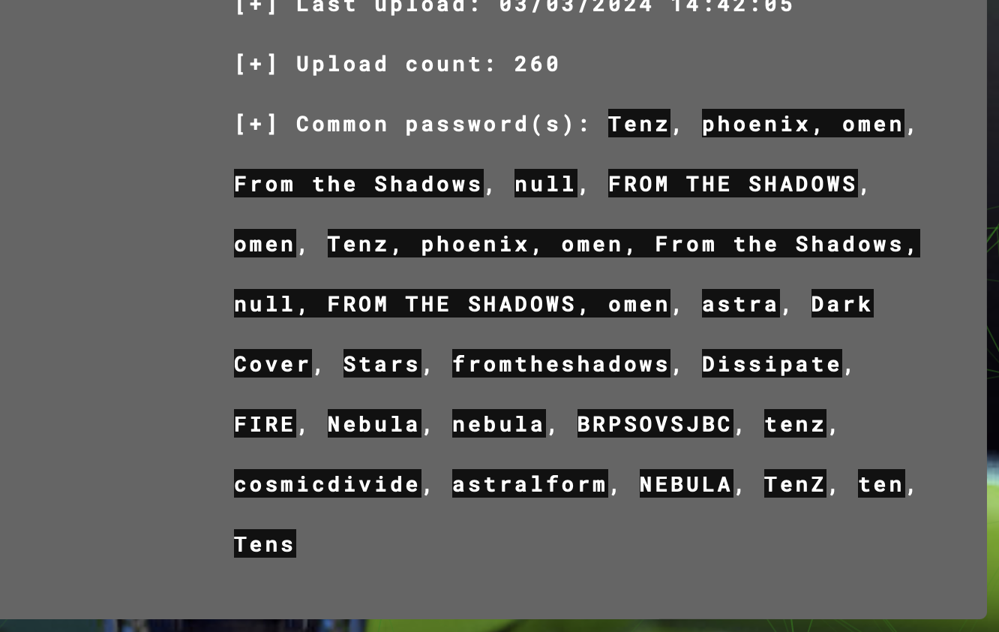
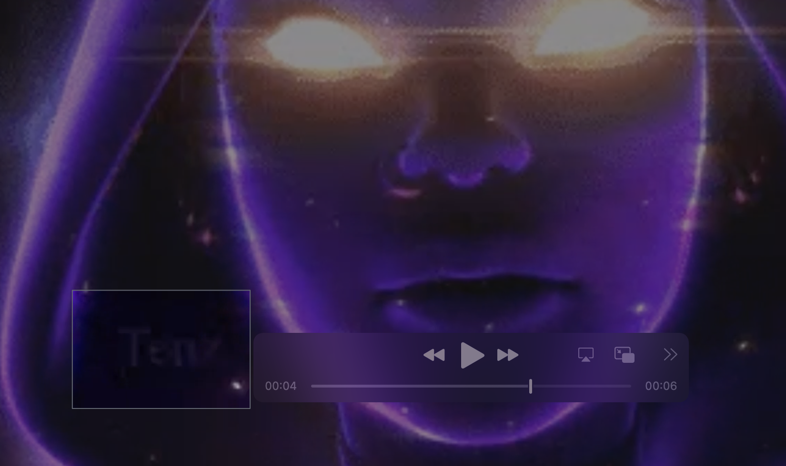
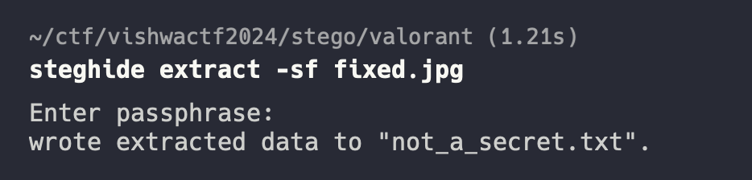

----
### TL;DR

**Flag**

```
VishwaCTF{you_are_invited_to_the_biggest_valorant_event}
```


### Details

Description
```
One day, while playing Valorant, I received a mail from Riot Games that read,

“In a world full of light, sometimes the shadows help you win.” “Your Signature move also helps you a lot ; develop one and ace it now.”

It also had an image and a video/gif attached to it. I am not able to understand what they want to say. Help me find what the message wants to express.

Author : Abhinav Mehta
```

Files: 


From `exiftool` we can see, that `.jpg` file is corrupted



Converting image to hex (cyberchef), we can see that file signature is corrupted

Signature our file
```
ff f8 d0 e0 00 10 4a 46 49 46 00
```

Correct signature
```
ff d8 ff e0 00 10 4a 46 49 46 00 
```

Correcting it, we got an image with Valorant agents


From [Apperi Solve](https://www.aperisolve.com/54fa6ab1ad452f8eda293ce34b86ab54) we can get password phrase -- `Tenz`



Password was in the `.mp4` file on 00.04 second


You can barely see `Tenz` here 
 
Using steghide and passphrase we can get the flag 



```
Hello!!
hope you are enjoying the CTF
here's your flag


VishwaCTF{you_are_invited_to_the_biggest_valorant_event}
```
