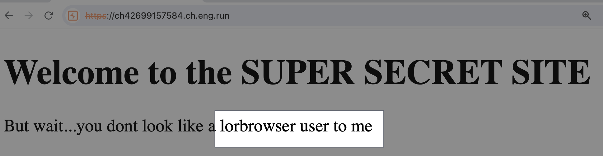
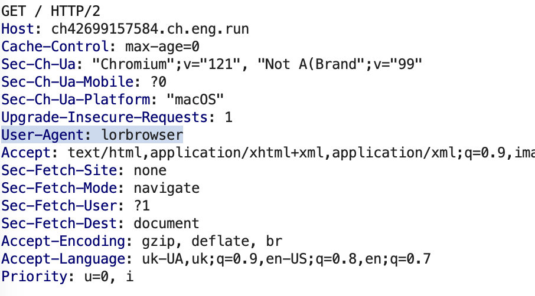
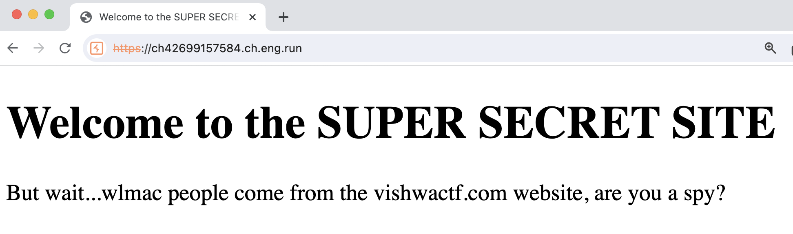
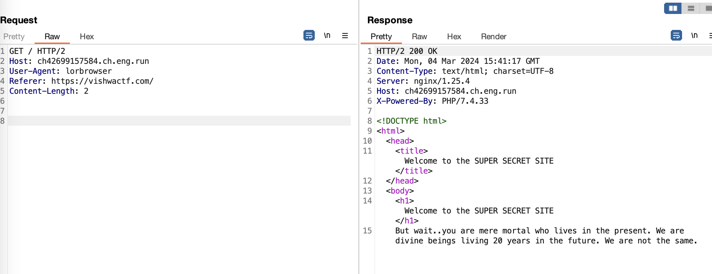

----
### TL;DR

UPD: My teammate solved this chall (failed myself cause of the incorrect date format lol) and I wanted to complete this WU, but half through the process, members in the discord pointed out that it was COMPLETELY stolen from CTF in 2023 -- https://github.com/daffainfo/ctf-writeup/tree/main/2023/WxMCTF%202023/WxMCTF%20Web%202%20-%20Restricted%20Access 

So, I don't see any reason for completing it now.


**Flag**

```
ctf{fake_flag}
```


### Details

Description
```
The name of the challenge says something.

Author: Samarth Kamble
```

Jump right into burpsuite. The first stage of this puzzle was related to `User-Agent` header



`User-Agent: lorbrowser`


Next is about `Referer` header

Use repeater in burpsuite, so that you don't have to repeat each step manually

Adding the next header to our request:
`Referer: https://vishwactf.com/`
(A slash in the end is very important -\_\-)

Next stage



Date. Here is the catch. Because of some *unkowntohumankind* issues, setting Date header like `Date: Mon, 04 Mar 2044 GMT` will not work. It must be `Date: 2024` for it to work.

