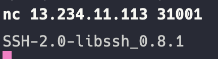
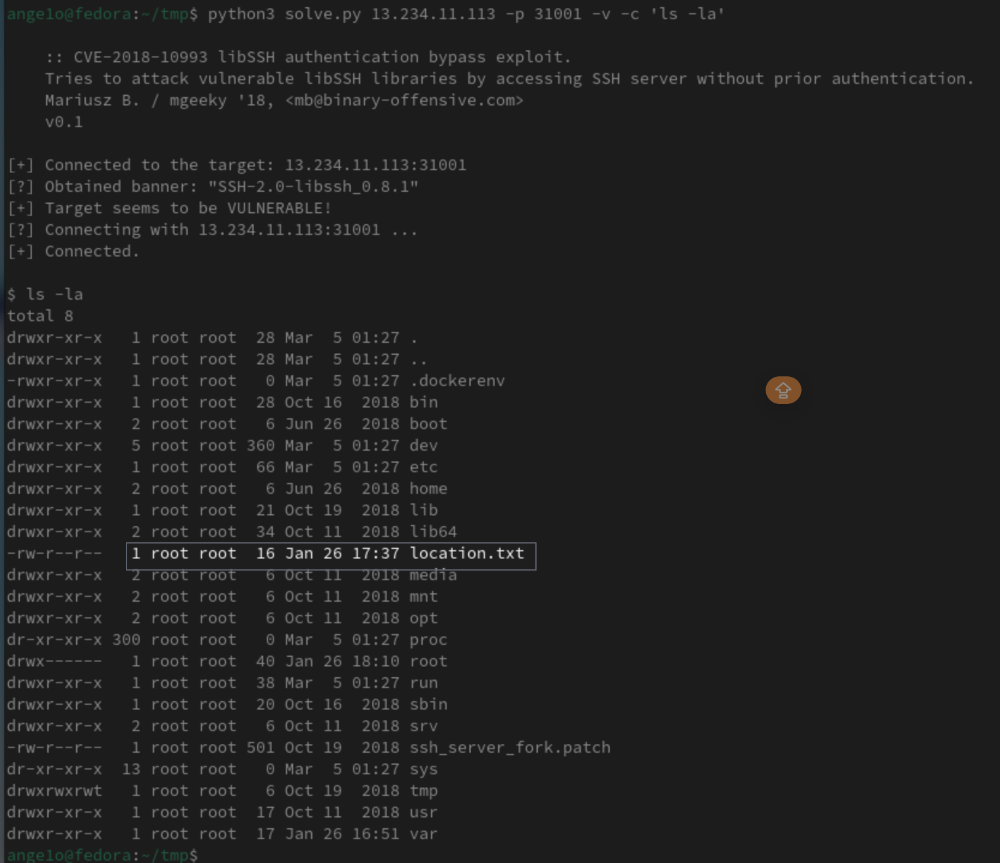
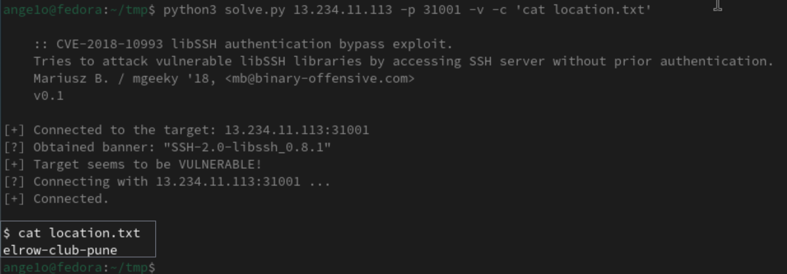

----
### TL;DR

**Flag**

```
VishwaCTF{elrow-cape-pune}
```

### Details

Description

> The RAW Has Got An Input That ISIS Has Planted a Bomb Somewhere In The Pune! Fortunately, RAW Has infiltrated the Internet Activity of One Suspect And They Found This Link. You Have To Find The Location ASAP!
> 
> Aurthor : Samarth Ghante & Harshali Patil

From the start, we have only an nc IP address. After connecting to it, it prompts with the SSH version. Specifically `libssh 0.8.1`



After several minutes of googling around, we can find that this version has an auth vulnerability. 

For that, we can use this `CVE-2018-10993` python script
https://gist.github.com/mgeeky/a7271536b1d815acfb8060fd8b65bd5d

```
python3 solve.py <ip> -p <port> -v -c 'ls -la'
```

From it, we can find `location.txt` 



Passing `cat location.txt` we can get our flag



```
VishwaCTF{elrow-club-pune}
```