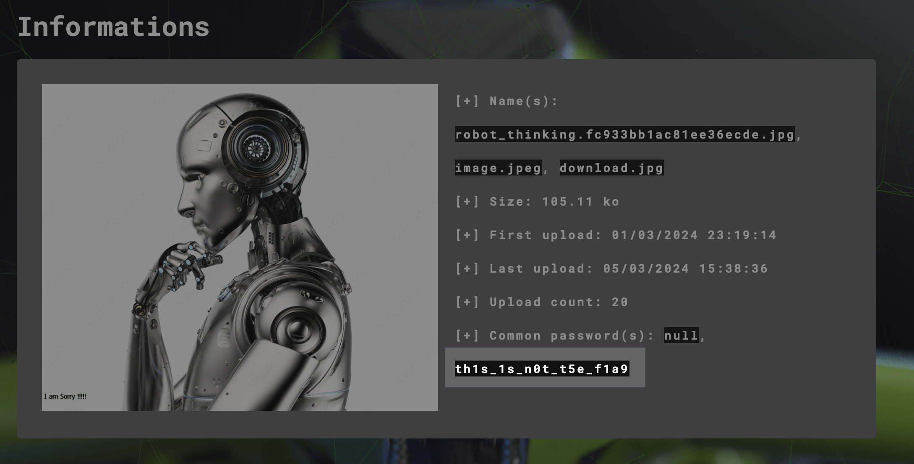
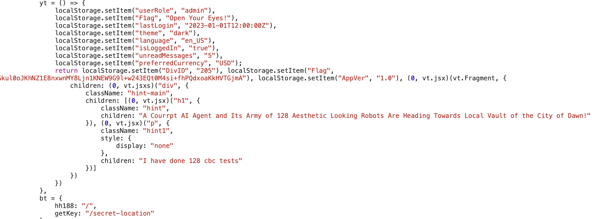
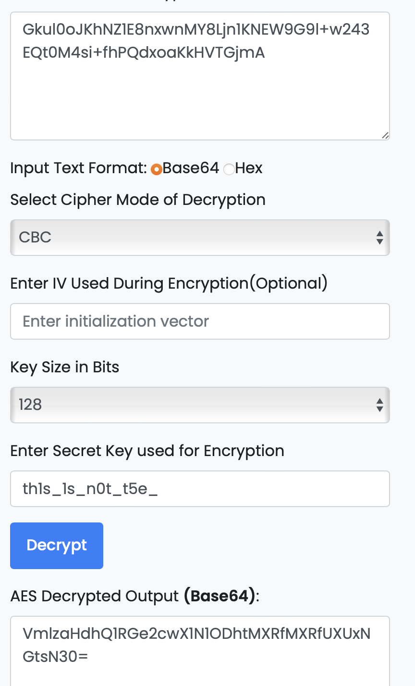

----
**Flag**

```
VishwaCTF{g0_Su88m1t_1t_Qu14kl7}
```

### Details

Description

> Aesthetic Looking army of 128 Robots with AGI Capabilities are coming to destroy our locality!

We get next site


From the beginning, we can see an image of the robot. Using AperiSolve checking its exif info.



```
th1s_1s_n0t_t5e_f1a9
```

There is some kind of a fake flag. In the description was mentioned number 128, maybe it's some kind of encryption and this is a key for it. 

From the website itself, in the `script.js` we can find some `localStorage` operation



From here we can find an encrypted flag 

```
Gkul0oJKhNZ1E8nxwnMY8Ljn1KNEW9G9l+w243EQt0M4si+fhPQdxoaKkHVTGjmA
```

Also, there is a hint that states: *"I have done 128 cbc tests"*. So, it is AES encryption 128 bytes long with CBC mode. 

Using some random tool for AES decryption we can get an error, that our key is too long (our key in utf-8 is 20 bytes, but for 128 input we need 16 bytes long key)

So, just delete last 4 chars from the key

```
th1s_1s_n0t_t5e_
```



And from that string: 

```
VishwaCTF{g0_Su88m1t_1t_Qu14kl7}
```