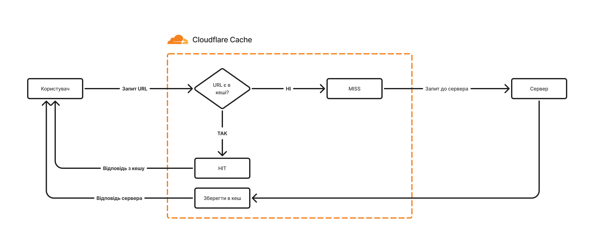
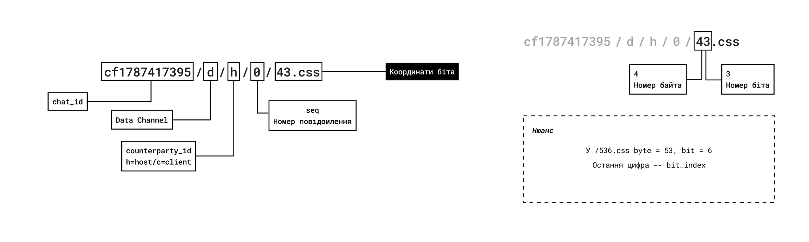
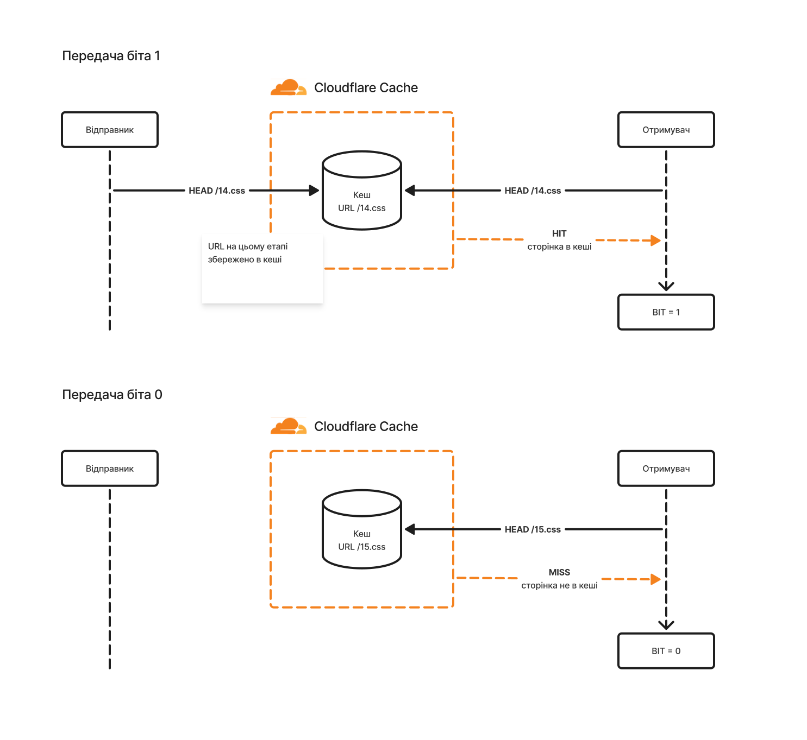

----
[<- Home](../../)
### TL;DR

**Flag**

```
NNS{1_l0v3_ch4tt1ng_w1th_m1n_b3st3_v3nn_1n_th3_cl0ud5}
```

Given a `.pcap` file, the traffic turns out to be chatflare (cool tool to communicate via Cloudflare's CDN cache). Each bit of a message is a separate URL; a `HIT`/`MISS` on `cf-cache-status` tells you whether that bit is `1` or `0`. Extract the probes, rebuild bitmaps and decode.
### Details 

**Description:** Signal wasn't secure enough so we moved to something else. I heard about something called chatflare, and it seemed interesting.

**Author:** 0xle

**Files:** `forensics_min-beste-venn.tar.gz`

## Assumption

Given file is a `.pcap`.

```bash
file capture.pcap
capture.pcap: pcap capture file, microsecond ts (little-endian) - version 2.4 (Ethernet, capture length 262144
```

Using`strings`  found repeating HTTP response blocks:

```bash
HTTP/1.1 404 Not Found
Date: Sat, 22 Aug 2026 16:50:24 GMT
Content-Type: text/html; charset=utf-8
Connection: keep-alive
x-amz-request-id: 0CFCNRMVDFJWEZFS
x-amz-id-2: uXx0fK3K7JVNsvQoFYCe33ctQjbcr1arZc8jF7dustIISKQuvHd1anznC9giEJsECLBxbPCX5o4=
Server: cloudflare
expires: Sat, 22 Aug 2026 20:50:24 GMT
Cache-Control: public, max-age=14400
cf-cache-status: MISS
CF-RAY: a2f360551eec33ca-HEL
```

Thought that that `x-am-id-2` could mean something. Pipeline to pull just the base64 values:

```bash
strings capture.pcap  | grep x-amz-id-2 | awk -F' ' '{print $2}'
```

```bash
QUeDOWtUJCZoUTBRF+tGBi4ePR5ewS8drtTY/WMncynJlr0sIR2D2LEhxckTqDaBXwImTYtltWE=
aVOO2sFcPd4a5ZnENMpeXISYkIIRJgbpwb9gHtUEv5rESttbqpAiKg8dgUv4Yz/Qr475dJpSj2s=
kPbq9AD/yDZCr2uy4bn7nWV4qBvT3qjBMA66upaY0XPoJelyba4YMPPlfXQrLx4bcegMPxGADsM=
T7aq70bHtgFo6vHor7X1T8zYwW+jVtksheWAbPi7LUvsNgPxBdGMNSeeZcgyKR4vpFEZmAhl1Qc=
nEmR2pCRWVG0Jqoyk/2ksnYTyI9Y27AOAODauLtzHXaEQLzs6X+nb12nzGdY6+y360qmM6UeryI=
mIQXubNZntN65VEd1/TEXloZxqzqQG7tFdAOc51bJtjOdSBRRWgbcl1QgxNTfo7ypZDPjVCc17M=
sSJ1k6e8Xgv1iPwV6+PAhZ32LPnaRjoj9qlw1CzpoWtGKpzXInvxlP5sUAx5qlX+m8np3Ip2ofU=
Fn1nuj4kuIm5nP4TmRUUZMSI4rQsMgu7DX3OIYh/cSM876tzRSqC755BjdlWrqfTyMhxk//S26Q=
KzgkMlp/LQTV4r/2G8J7XFiEhKJ85hPJBSxkT/FLAAVrBMZqI31GY579Xdid4+HAzevhdHsIU74=
cVYxrFeYvYIhFyNR54+FI4zTRXHyQkpnAyx6JqT5+7o3d6ToXIlbJkIc67qnOckrMZZWNULM7yk=
...
```

Decoding them with `base64 -d` gave nothing usable:

```bash
strings capture.pcap  | grep x-amz-id-2 | awk -F' ' '{print $2}' | base64 -d > base64dump

file base64dump 
base64dump: data
```

Ohh.. `amz`.. So these are just aws s3 request headers.. nvm.
 
```bash
x-amz-request-id: HJV8JBWQMZ77WTDS
x-amz-id-2: F09YRlMQFY+OvNJoDGJen2WV2yEP5ZBwITq/jxxg7CLz3wycoqxg7lZg7jIRz/BcbhjmE4bs0uc=
```


> Amazon S3 needs two identifiers to fully trace a request. The X-Amz-Id-2 unofficial response header provides the second, an extended request identifier (host ID) pinpointing the S3 host that processed the request.

src: https://http.dev/x-amz-id-2

> The HTTP X-Amz-Request-Id unofficial response header contains a unique identifier assigned by Amazon S3 to every request, serving as the primary reference for log correlation and support cases.

src: https://http.dev/x-amz-request-id

On the second try found what `chatflare` meant in the description => https://github.com/beescuit/chatflare. Cool tool to chat via Cloudflare cache hits.
## How it works

### Cloudflare cache 101
Cloudflare sits in front of the origin server as a CDN. When someone requests a URL, the edge first asks itself: is this URL already in the cache?

- **MISS** -- not cached yet. Cloudflare goes to the origin server, returns the response, and stores a copy on the way back. The response carries `cf-cache-status: MISS`.
- **HIT** -- already cached. Cloudflare serves the stored copy straight away and never touches the origin. `cf-cache-status: HIT`.



The property chatflare abuses: the _first_ request to any URL is always a MISS, and that same request is what puts the URL into the cache. So one `HEAD` request does two things at once -- it reads the current state (`HIT`/`MISS`) and it sets it. The cache becomes a shared, writable board that two parties can poke at without ever talking to each other directly.
### The channel

Both sides make `HEAD`request to the same endpoint behind Cloudflare and read the `cf-cache-status` header. Key information: whether the URL is already cached.

cdn behaviour:
```
first request to a URL -> cf-cache-status: MISS (not cached; now stored)
next request           -> cf-cache-status: HIT  (already cached)
```

So a single `HEAD` request does two things at once:
1. reads the current state (`HIT`/`MISS`) 
2. sets it

From the docs:
Every 1 second, a client polls their counterparty's signalling channel via `{chat_id}/{counterparty_id}/s{timestamp_s}.css` (where `counterparty_id` is `h` for "host" and `c` for "client"). When the counterparty decides to send a message, it first writes all of the message's individual `1` bits to its data channel via `{chat_id}/d/{counterparty_id}/{seq}/{byte_index}{bit_index}.css`

**Signalling channel:**
```
HEAD /cf1787417395/c/s1787417410.css HTTP/1.1 
```

where:
- `cf1787417395`: chat_id
- `/c/`: counterparty_id (c=client)
- `/s1787417410`: timestamp_s 

**Data channel:**
```
/cf1787417395/d/h/0/43.css
```

where: 
- `cf1787417395`: chat_id
- `/d/`: data channel
- `h`: counterparty_id (h=host)
- `0`: seq; message index starting at 0
- `43`: `4` = byte_index, `3` = bit_index
- the first byte of every message is always its length



>[!NOTE]
> `bit_index` is always a single digit (0-7), so in a coordinate like `43` the last character is the bit and everything before it is the byte. For a coordinate like `536` => `byte = 53`, `bit = 6`, not `5` and `3`. This matters for msgs > 9 bytes long. 

### Encoding example

Client sends `hey!`:

**Step 1.** Prepend the length and convert to bytes:

```
len ("hey!") = [4]   <- byte_idx 0
h => [104]           <- byte_idx 1
e => [101]           <- byte_idx 2
y => [121]           <- byte_idx 3
! => [33]            <- byte_idx 4
```

**Step 2.** Split each byte into 8 bits. Left to right: MSB(128) on the left, LSB(1) on the right. 

| byte_idx | dec | 0   | 1   | 2   | 3   | 4   | 5   | 6   | 7   |
| -------- | --- | --- | --- | --- | --- | --- | --- | --- | --- |
| 0        | 4   | .   | .   | .   | .   | .   | 1   | .   | .   |
| 1        | 104 | .   | 1   | 1   | .   | 1   | .   | .   | .   |
| 2        | 101 | .   | 1   | 1   | .   | .   | 1   | .   | 1   |
| 3        | 121 | .   | 1   | 1   | 1   | 1   | .   | .   | 1   |
| 4        | 33  | .   | .   | 1   | .   | .   | .   | .   | 1   |

**Step 3.** Take *only* the `1` bits and turn them into coordinates. 

| byte | byte_idx | bit_idx | file_name |
| ---- | -------- | ------- | --------- |
| 4    | 0        | 5       | `05.css`  |
| 104  | 1        | 1       | `11.css`  |
| 104  | 1        | 2       | `12.css`  |
| 104  | 1        | 4       | `14.css`  |
| 101  | 2        | 1       | `21.css`  |
| 101  | 2        | 2       | `22.css`  |
| 101  | 2        | 5       | `25.css`  |
| 101  | 2        | 7       | `27.css`  |
| 121  | 3        | 1       | `31.css`  |
| 121  | 3        | 2       | `32.css`  |
| 121  | 3        | 3       | `33.css`  |
| 121  | 3        | 4       | `34.css`  |
| 121  | 3        | 7       | `37.css`  |
| 33   | 4        | 2       | `42.css`  |
| 33   | 4        | 7       | `47.css`  |

## Request logic



### Send

The sender probes only the URLs of `1` bits. It doesn't care about the response. Goal is just to warm those URLs into cache. The first touch is always `MISS`.

```
HEAD /d/h/0/11.ext => MISS (first time; now cached)
HEAD /d/h/0/14.ext => MISS (same logic)
```

### Recv

The receiver doesn't know in advance which bits are `1` and which are `0`, so it probes every position and looks at the status. Has two phases:

**Phase 1.** Length
Looks for the length of the message. The first byte (`byte_idx = 0`) is always the length. The receiver probes exactly 8 URLs (`00...07`), rebuilds the bitmap from `HIT`/`MISS`, and gets the body size. Receiving side doesn't know when the data is ready, so the signalling (timestamp) requests act as a handshake -- "list to the channel now".

**Phase 2.** Body
Knowing the length `len`, it generates `len * 8` URLs (bytes `1..=len`, 8 bits each) and probes them all, reconstructing each byte's bitmap.

## Parser

### Step 0. Extract from the pcap

Extract the requests (this is were the `uri` lives):
```
tshark -r capture.pcap -Y "http.request" -T fields -E separator="|" -e frame.number -e http.request.uri > requests.txt
```

Extract the responses (this is where the status lives, + a link to the request frame via `http.request_in`)
```
tshark -r capture.pcap -Y "http.response" -T fields -E separator="|" -e frame.number -e http.request_in -e http.response.line > responses.txt
```

Where:
- `-r` : read from a file
- `-Y` : display filter
- `-T fields` : flat, field-based output
- `-E separator="|"` : column separator (`response.line` contains its own commas, so `|` safer)
- `-e` : which field goes in which column

Samples `requests.txt`:
```
4|/cf1787417395/h/s1787417396.css
8|/cf1787417395/h/s1787417397.css
34|/cf1787417395/d/h/0/06.css
35|/cf1787417395/d/h/0/04.css
38|/cf1787417395/d/h/0/12.css
39|/cf1787417395/d/h/0/07.css
43|/cf1787417395/d/h/0/14.css
46|/cf1787417395/d/h/0/15.css
50|/cf1787417395/d/h/0/31.css
51|/cf1787417395/d/h/0/21.css
```

Sample `responses.txt`:
```
6|4|Date: ... ,cf-cache-status: MISS\r\n,CF-RAY: a2f35faa2e8f7601-HEL\r\n
90|62|Date: ... ,cf-cache-status: MISS\r\n,CF-RAY: a2f35fb068b233ca-HEL\r\n
```

`http.request_in` allows to combine them: in response row it's the frame number of its request. 

### Step 1. Merge request <-> response

Build `{frame -> uri}` from the requests, then for each response pull the `uri` by `request_in` and extract the status with a regex.

### Step 2. Parse the uri -> probe

Data path has exactly 6 segments and a `d` segment. This drops signalling paths (`/h/s...`, 4 segments) and stray traffic.


### Step 3. Diagnostics

In the `.pcap` a single `(byte, bit)` often has several touches with different statuses. We need to figure out which one to trust. Group by `(direction, seq, byte)` and look at which bit are present:

```python
from collections import defaultdict

groups = defaultdict(list)
for p in probes:
    groups[(p.direction, p.seq, p.byte)].append(p)

for key, plist in list(groups.items())[:4]:
    bits = sorted(p.bit for p in plist)
    print(key, "->", len(plist), "prob, bits:", bits)
```

```
('h', 0, 0) -> 12 prob, bits: [0, 1, 2, 3, 4, 4, 5, 5, 6, 6, 7, 7]
('h', 0, 3) -> 13 prob, bits: [0, 1, 1, 2, 2, 3, 4, 4, 5, 5, 6, 6, 7]
('h', 0, 1) -> 13 prob, bits: [0, 1, 1, 2, 2, 3, 4, 4, 5, 5, 6, 7, 7]
('h', 0, 2) -> 12 prob, bits: [0, 1, 1, 2, 2, 3, 4, 4, 5, 6, 7, 7]
('h', 0, 4) -> 9 prob, bits: [0, 1, 2, 2, 3, 4, 5, 6, 7]
```

All positions 0–7 are present, but some are doubled. Look at the statuses of each position in chronological order:

```python
key = ("h", 0, 3)
by_bit = defaultdict(list)
for probe in groups[key]:
	by_bit[probe.bit].append(probe.status)
for bit in range(8):
	print(bit, by_bit[bit])
```

```
0 ['MISS']
1 ['MISS', 'HIT']
2 ['MISS', 'HIT']
3 ['MISS']
4 ['MISS', 'HIT']
5 ['MISS', 'HIT']
6 ['MISS', 'HIT']
7 ['MISS']
```

So yeah, it follows directly from the send/recv mechanics:
- A `1` bit is touched twice: the sender "warms" it (`MISS`) + receiver reads it (`HIT`)
- A `0` bit is touched once by receiver (`MISS`)

```
['MISS', 'HIT']  ->  bit = 1
['MISS']         ->  bit = 0
```

This implies we have two independent decode criteria that must agree:
1. final status of the position: `HIT` -> 1, `MISS` -> 0;
2. touch count: 2 -> 1; 1 -> 0.

We use (1), "last status". It's more robust + matches what the original `recv_message` does. 
`build_last` walks the probes in chronological order and overwrites the status for each `(direction, seq, bytes, bit)`

Check on `('h', 0, 3)`:
```
bit:  0 1 2 3 4 5 6 7
val:  0 1 1 0 1 1 1 0   =  0x6E  =  110  =  'n'
```

### Step 4. Full parser

```python
import argparse
import re
from collections import defaultdict
from pathlib import Path
from typing import NamedTuple

STATUS_RE = re.compile(r"cf-cache-status:\s*(\w+)")
EXT = ".css"


class Probe(NamedTuple):
    direction: str
    seq: int
    byte: int
    bit: int
    status: str


def parse_args(argv=None) -> argparse.Namespace:
    parser = argparse.ArgumentParser(description="Chatflare parser")

    parser.add_argument(
        "-r", "--requests", type=Path, help="Requests filepath", required=True
    )
    parser.add_argument(
        "-re", "--responses", type=Path, help="Response filepath", required=True
    )

    return parser.parse_args(argv)


def read_lines(path):
    with open(path, "r", encoding="utf8", errors="ignore") as file:
        for line in file:
            cleaned = line.strip()
            if cleaned:
                yield cleaned


def parse_uri(response_list: list[tuple[str, str]]) -> list[Probe]:

    probes = []

    for uri, status in response_list:
        parts = uri.split("/")
        if len(parts) != 6:
            continue

        _, _, channel_type, direction, seq, value = parts

        if channel_type != "d":
            continue

        value = value.removesuffix(EXT)
        byte = value[:-1]
        bit = value[-1]

        probes.append(Probe(direction, int(seq), int(byte), int(bit), status))

    return probes


def bitmap_to_byte(bits: list[bool]) -> int:
    if len(bits) != 8:
        raise ValueError("Expected exactly 8 bits")

    value = 0

    for i, bit in enumerate(bits):
        value |= int(bit) << (7 - i)

    return value


def assemble_byte(last, dir, seq, byte):
    bits = [last.get((dir, seq, byte, bit)) == "HIT" for bit in range(8)]
    return bitmap_to_byte(bits)


def build_last(probes):
    last = {}
    for probe in probes:
        key = (probe.direction, probe.seq, probe.byte, probe.bit)
        last[key] = probe.status

    return last


def main():
    args = parse_args()
    requests_frame = {}
    response = []

    for line in read_lines(args.requests):
        if "|" in line:
            frame_num, uri = line.split("|", 1)
            requests_frame[frame_num] = uri

    for line in read_lines(args.responses):
        if "|" in line:
            frame_num, req_in, resp_line = line.split("|", 2)

            if not (frame_num.isdigit() and req_in.isdigit()):
                continue

            if not (status := STATUS_RE.search(resp_line)):
                continue

            status_mark = status.group(1)

            if not (uri := requests_frame.get(req_in)):
                continue

            response.append((uri, status_mark))

    probes = parse_uri(response)

    last = build_last(probes)
    messages = {(dir, seq) for (dir, seq, byte, bit) in last}

    for dir, seq in messages:
        length = assemble_byte(last, dir, seq, 0)
        text_bytes = [assemble_byte(last, dir, seq, i) for i in range(1, length + 1)]

        print(dir, seq, bytes(text_bytes).decode())


if __name__ == "__main__":
    main()

```

Run it:
```
python chatflare.py -r requests.txt -re responses.txt
```

It reconstructs the whole conversation from both sides (`h` = host, `c` = client) and the flag is among the messages:

```
c 1 NNS{1_l0v3_ch4tt1ng_w1th_m1n_b3st3_v3nn_1n_th3_cl0ud5}
c 0 ja?
h 0 min beste venn?
h 1 can i haz flag?
```

